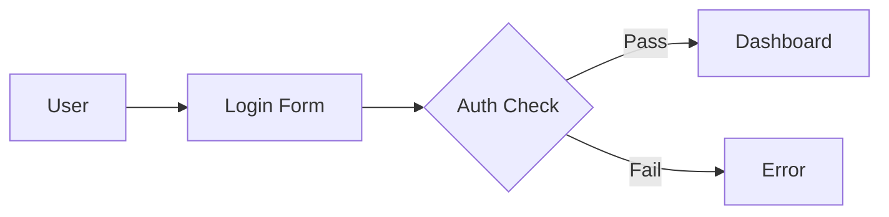

# Diagram Orchestrator

Single entry point for all diagram generation. Routes automatically to the correct tool based on complexity, keywords, and output context.

---

## Decision Tree

```
User request → /diagram-orchestrator [type] [concept] [quick|draft|publish]
                        |
          ┌─────────────┼─────────────────────┐
          ▼             ▼                     ▼
   Keyword: quick   Keyword: draft      Keyword: publish
   OR ≤5 nodes      OR 6–15 nodes       OR 16+ nodes
   OR inline        OR editable         OR png/blog
          |             |                     |
          ▼             ▼                     ▼
      TIER 1         TIER 2               TIER 3
     Mermaid      Excalidraw JSON       kie.ai PNG
   visualization  excalidraw-diagram  excalidraw-visuals
    → .md file    → .excalidraw file    → .png file
```

---

## Routing Rules

### Keyword Overrides (highest priority)

| Keyword in args  | Forced Tier |
|-----------------|-------------|
| `quick`         | Tier 1      |
| `inline`        | Tier 1      |
| `draft`         | Tier 2      |
| `editable`      | Tier 2      |
| `publish`       | Tier 3      |
| `png`           | Tier 3      |
| `blog`          | Tier 3      |

Keywords override node count. They are checked first.

### Node Count (when no keyword)

| Estimated nodes | Tier assigned |
|----------------|--------------|
| ≤5             | Tier 1       |
| 6–15           | Tier 2       |
| 16+            | Tier 3       |

Auto-escalation: if node count exceeds tier limit mid-generation, the orchestrator escalates automatically and notifies you.

### Diagram Type Defaults

| Type           | Default Tier | Notes                              |
|----------------|--------------|------------------------------------|
| `flowchart`    | 1            | Mermaid handles simple flows well  |
| `comparison`   | 1            | Side-by-side branches in Mermaid   |
| `timeline`     | 1            | Mermaid `timeline` syntax          |
| `architecture` | 2            | Always uses sequential thinking    |
| `state-machine`| 2            | Sequential thinking if >8 states   |
| `hub-and-spoke`| 2            | Star topology suits Excalidraw     |
| `data-flow`    | 2            | Always uses sequential thinking    |

---

## Integration Examples

### Tier 1 — Quick Mermaid

```
/diagram-orchestrator flowchart login process quick
```

Calls `visualization` skill. Output: `archives/diagrams/2026-04-30-login-process-mermaid.md`



### Tier 2 — Editable Excalidraw

```
/diagram-orchestrator architecture MCP Docker stack
```

Calls `excalidraw-diagram` skill with brand palette. Output: `archives/diagrams/2026-04-30-mcp-docker-stack-draft.excalidraw`

Open at excalidraw.com — every element is draggable and editable.

### Tier 3 — Publish-Quality PNG

```
/diagram-orchestrator comparison GraphRAG vs RAG publish
```

Calls `excalidraw-visuals` skill (kie.ai). Output: `archives/diagrams/2026-04-30-graphrag-vs-rag-comparison-publish.png`

Blog/docs ready. Rendered with hand-drawn Excalidraw aesthetic.

---

## Brand Palette (passed to downstream skills)

| Role       | Stroke      | Fill        |
|-----------|-------------|-------------|
| Primary    | `#006e56`   | `#c2fff1`   |
| Secondary  | `#00b2a9`   | `#e0faf6`   |
| Container  | `#004a3a`   | `#b3f5e6`   |
| Warning    | `#d97706`   | `#fef3c7`   |
| Neutral    | `#334155`   | `#f1f5f9`   |
| Connector  | `#64748b`   | `#e2e8f0`   |

**Note:** Brand palette is for visual color zones only. Diagram voice is always technical/neutral — no electrical-services marketing language passes to diagram skills.

---

## Sequential Thinking Gate

Applied automatically for: `architecture`, `data-flow`, `state-machine` (Tier 2/3 only).

The orchestrator calls `mcp__MCP_DOCKER__sequential_thinking__*` before delegating to ensure:
- All nodes are enumerated (nothing missed)
- Relationships are directional and accurate
- Hierarchy / containment is correct
- Tier is validated against actual complexity

---

## Output Paths

All diagrams save to: `archives/diagrams/`

| Tier | File name pattern                              |
|------|------------------------------------------------|
| 1    | `YYYY-MM-DD-[slug]-mermaid.md`                 |
| 2    | `YYYY-MM-DD-[slug]-draft.excalidraw`           |
| 3    | `YYYY-MM-DD-[slug]-publish.png`                |

Slug = concept name in kebab-case, max 5 words, no articles/prepositions.

---

## When NOT to Use This Skill

| Scenario                               | Better alternative              |
|----------------------------------------|---------------------------------|
| 2–3 items that fit in a sentence       | Write a sentence                |
| Structured tabular data                | Markdown table                  |
| UI wireframe or mockup                 | Dedicated design tool           |
| Non-supported format (Visio, draw.io)  | Note limitation; export from T2 |
| Real-time/live data visualization      | Charting library (Chart.js etc.)|

---

## 7 Supported Diagram Types

| Type           | Description                                   | Example concept              |
|----------------|-----------------------------------------------|------------------------------|
| `architecture` | System/component maps with containers         | "MCP Docker stack"           |
| `flowchart`    | Process or decision flows                     | "User login process"         |
| `comparison`   | Side-by-side trade-off analysis               | "GraphRAG vs RAG"            |
| `state-machine`| Lifecycle or status transitions               | "Order status lifecycle"     |
| `hub-and-spoke`| Centralized topology with radiating nodes     | "Skills taxonomy"            |
| `timeline`     | Chronological event sequences                 | "Project phase history"      |
| `data-flow`    | Pipeline and data movement diagrams           | "ETL ingestion pipeline"     |
