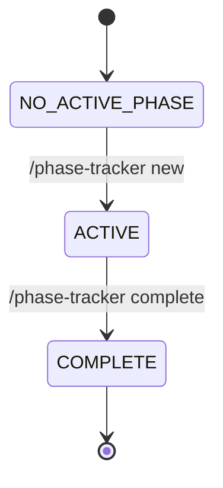

# Visualization Skill — Execution Tier

**Skill #13** | Part of the Execution Tier | Generates production-quality Mermaid diagrams

## Purpose

Transforms technical requirements, system documentation, schemas, and code into visual Mermaid diagrams—flowcharts, state machines, ERDs, architecture maps, dependency graphs, and more.

This skill fills a critical gap: while `/content-creation` generates marketing content, `/visualization` specializes in technical diagrams that appear in system documentation, client deliverables, and architecture references.

## When to Use

**Use `/visualization` when:**
- You need to visualize a workflow, process, or pipeline
- You're creating architecture documentation
- You want to show system dependencies or relationships
- You're generating an entity-relationship diagram (ERD)
- You need a state machine or lifecycle diagram
- You're creating timeline or Gantt charts
- You want to clarify complex system interactions

**Use `/content-creation` instead if:**
- You're writing marketing blogs or landing pages
- You need social media content or email campaigns
- You're generating case studies or testimonials

## Key Features

✅ **Mermaid-native** — All diagrams render in GitHub, VS Code, and web tools
✅ **Type-aware** — Selects appropriate diagram type for your input
✅ **Scalable** — Delegates to agent for complex diagrams (10+ nodes)
✅ **Archive-ready** — Saves to organized paths for easy retrieval
✅ **Integration-ready** — Works with system docs, schemas, code, and descriptions

## Architecture

The skill operates in three layers:

### Layer 1: Parser (Claude-native)
- Receives diagram request
- Identifies diagram type
- Extracts source material
- Determines output path

### Layer 2: Agent (for complex diagrams)
- Delegates extraction of nodes/edges
- Haiku models handle structure identification
- Returns structured data: `{ nodes: [...], edges: [...], labels: {...} }`

### Layer 3: Generator (Claude-native)
- Assembles Mermaid syntax
- Validates bracket matching and node IDs
- Wraps in `.md` file with context
- Saves to archive path

## Execution Steps

1. Parse input → Identify diagram type
2. For simple diagrams: Extract structure directly
3. For complex diagrams: Delegate to agent
4. Generate Mermaid code
5. Validate syntax
6. Save to appropriate archive
7. Return rendered preview + archive path

## Output Specifications

**Format:** Markdown file with Mermaid code block
**Location:** `references/diagrams/`, `archives/plans/`, or `archives/client-work/[client]/`
**Naming:** `YYYY-MM-DD-[diagram-type]-[subject].md`
**Content:** Title + description + Mermaid syntax block

**Example output file:**
```markdown
# Skill Dependency Map

Shows how all 14 skills relate and feed into each other.

```mermaid
graph TD
    ... Mermaid syntax ...
```
```

## Integration Points

### Inputs From
- **System documentation** (CLAUDE.md, READMEs, architecture docs)
- **Code files** (for structure extraction)
- **Database schemas** (for ERDs)
- **Planning Skill** outputs (for workflow visualization)
- **Phase Tracker** (for state machine diagrams)
- **User descriptions** (can auto-detect diagram type)

### Outputs To
- **ONBOARDING.md** (embed workflow diagrams)
- **Project READMEs** (architecture overviews)
- **Client deliverables** (architecture ERDs)
- **references/ folder** (system diagrams)
- **archives/plans/** (project diagrams)

### Skill Composition
- **Upstream:** Planning Skill (provides workflow descriptions)
- **Downstream:** Knowledge Memory (archives diagrams), Client Management (client ERDs)
- **Peer integration:** Can visualize outputs from any skill

## Examples

### Example 1: Workflow Diagram
**Input:** "Create a flowchart for the content campaign workflow"
**Output:** `references/diagrams/2026-03-10-flowchart-content-campaign.md`


### Example 2: State Machine
**Input:** "Generate state machine for Phase Tracker"
**Output:** `references/diagrams/2026-03-10-state-machine-phase-tracker.md`


### Example 3: Dependency Graph
**Input:** "Create a graph of all 14 skills"
**Output:** `references/diagrams/2026-03-10-graph-skill-dependencies.md`
```mermaid
graph TD
    Research --> Strategy
    Strategy --> Planning
    Planning --> CodeGen
    Planning --> ContentCreation
    ... (etc)
```

## When NOT to Use

❌ Do NOT use visualization for:
- Whiteboard sketches needing polish (use excalidraw-visuals for hand-drawn style)
- Marketing infographics (use infographic-creator instead)
- Detailed product screenshots (use excalidraw-diagram or nano-banana-images)
- Simple bullet lists (Mermaid adds unnecessary complexity)

## Troubleshooting

| Issue | Cause | Solution |
|-------|-------|----------|
| Mermaid syntax error | Invalid brackets or node IDs | Use agent for extraction if >10 nodes |
| Diagram too cluttered | Too many nodes without grouping | Split into multiple diagrams or use subgraphs |
| References not found | Source file doesn't exist | Verify path exists and is readable |
| Missing `references/diagrams/` | Directory doesn't exist yet | Skill creates it on first use; ensure write permissions |

## Reference Documentation

- **SKILL.md** — Full skill specification with all execution steps
- **Worked examples:** `references/examples/visualization/worked-examples.md`
- **Mermaid docs** — https://mermaid.js.org/ (diagram syntax reference)
- **SKILL-DEPENDENCY-DIAGRAM.md** — Examples of dependency graphs
- **ONBOARDING.md** — Examples of embedded workflow diagrams

---

**Phase:** Phase 4 (A++ Documentation Excellence)
**Tier:** Execution (produces artifacts)
**Last updated:** 2026-03-10
