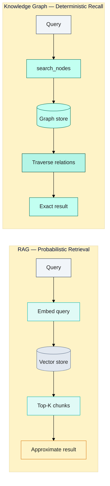
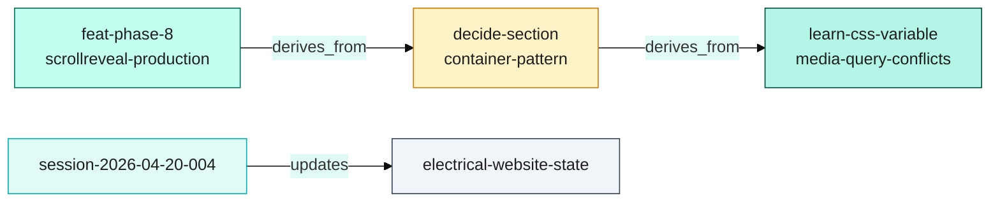
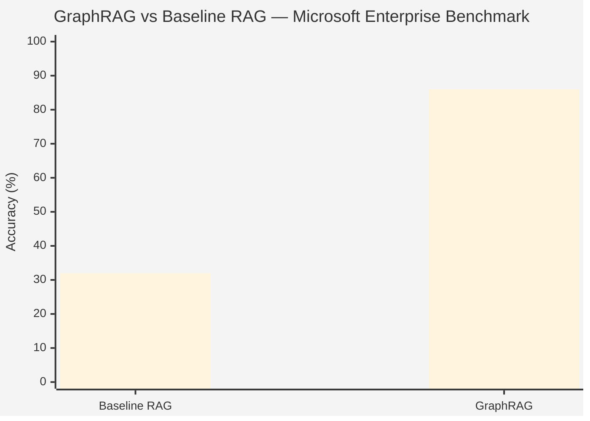

# Beyond RAG: Why We Built a Knowledge Graph for AI Development Memory

When we started building persistent memory for our AI development workflow, the intuitive choice was obvious: use a vector database and RAG. Every developer knows the pattern. Embed your documents, store the vectors, retrieve by similarity at query time. It's the default architecture for AI memory in 2025, underpinning a market projected to reach $9.86 billion by 2030 (38.4% CAGR).

We almost went that route. Then we thought carefully about what we actually needed to remember — and realized RAG would solve the wrong problem.

This post explains why we built a knowledge graph instead, what we learned from the industry's leading alternatives (MemGPT, LangMem), and when each approach is actually the right tool for the job.

---

## Why We Didn't Use RAG

The diagram below contrasts the two retrieval paths — flat probabilistic vector search on the left, deterministic multi-hop graph traversal on the right.



RAG works by converting documents into embeddings — dense numerical vectors that capture semantic meaning — then retrieving the most similar chunks when a query arrives. For semantic search over a corpus of documents, this is excellent. For structured session memory in a development workflow, it has five structural problems.

**1. No entity relationships in flat vector embeddings.**

A vector embedding captures semantic similarity. It does not capture relationships. Consider the kind of context a development session needs: "feat-phase-8-scrollreveal-production was merged in PR #92, which fixed 13 failing e2e tests, on branch feat/phase-8-scrollreveal-production, building on the decide-section-container-pattern decision from Phase 7." That is a web of named entities with typed relationships. A flat embedding of this text might retrieve it when you ask about "Phase 8" — but it cannot answer "what decisions influenced Phase 8?" without traversing a graph that doesn't exist.

**2. Probabilistic retrieval — items can be missed.**

RAG retrieval is probabilistic. The similarity threshold is a dial, not a guarantee. Lower it and you get noise; raise it and you miss relevant context. For session memory, we need deterministic recall: `search_nodes("phase-8")` should return the Phase 8 entity every time, with 100% reliability. Probabilistic retrieval is acceptable for "what's a related concept?" — it is not acceptable for "what was the last architectural decision we made?"

**3. No session persistence by default.**

A vector database stores vectors. It has no concept of a session, a project, or a point in time. Building session lifecycle management on top of a vector store requires significant additional infrastructure: metadata schemas, time-ordered retrieval, FIFO eviction logic. These are solved problems in knowledge graphs by design.

**4. Cannot update without re-indexing.**

When a session ends and we learn something new, we want to add an observation to an existing entity: "the navbar active state bug was caused by pushState not triggering hashchange events." With a vector store, this means re-embedding and re-indexing. With a knowledge graph, it's a single append operation. At the pace of daily development sessions, re-indexing becomes a bottleneck.

**5. Ordering and timing of information is discarded.**

Vector embeddings are timeless. There is no notion of "this decision came before that one" or "this session was three months ago." Development context is deeply temporal: knowing that a refactor happened after a performance audit matters. Knowledge graphs preserve temporal ordering via entity metadata and relation timestamps.

RAG, in other words, is optimized for breadth over depth — for searching a large corpus, not for maintaining structured relational context over time.

---

## What Knowledge Graphs Add

A knowledge graph models the world as entities and typed relations. An entity is a named node with attributes and observations. A relation is a directed, typed edge between two entities: "feat-phase-8 **builds_on** decide-section-container-pattern." This model maps directly onto how developers actually think about their work.

**Deterministic recall.** `search_nodes("phase-8")` returns the exact entity set for "phase-8" every time. No threshold tuning, no recall degradation. The graph is an index; lookup is exact.

**Multi-hop reasoning.** "What decisions influenced the animation architecture?" becomes a graph traversal: find feat-phase-7-animation-polish → follow derives_from edges → find decide-* entities → return. RAG cannot do this without multiple retrieval passes and LLM stitching, introducing probabilistic failure at every hop.

A concrete example from the production graph — a single derives_from traversal reveals the full chain of decisions behind a feature:



**Relation typing matters.** Not all relationships are equal. `updates`, `builds_on`, `derives_from`, `documents` each carry different semantics. When Claude at session start reads that session-2026-04-18-001 `updates` electrical-website-state, it knows this is a state transition, not a derivation. Typed edges are metadata-rich in a way flat embeddings are not.

**The benchmarks support this.** Microsoft's GraphRAG (github.com/microsoft/graphrag) — which combines knowledge graph extraction with RAG — achieves 54.2% average accuracy improvement over plain RAG. On enterprise benchmarks: 86% accuracy versus 32% for baseline RAG. LazyGraphRAG outperformed all comparison conditions across 96 benchmark comparisons. A 2025 systematic review (arxiv:2502.11371) confirms GraphRAG outperforms vanilla RAG specifically on complex cross-document queries. The academic and industry evidence is converging: for structured, relational queries, graphs win.

The accuracy gap is substantial on complex enterprise queries where relationship traversal matters:



The caveat: vanilla RAG still wins on simple single-document lookup. The domains are different. GraphRAG costs 3–5× more in LLM calls during extraction. It is not a universal replacement — it is the right tool for a specific class of problem.

---

## MemGPT and LangMem: The Industry's Approaches

We are not the first team to notice RAG's limitations for agent memory. The two most influential production approaches take distinct positions.

**MemGPT (now Letta)**

MemGPT (arxiv:2310.08560, UC Berkeley 2023) treats LLMs as operating systems. The core insight: a CPU has fixed-size registers (working memory) and manages a larger memory hierarchy by paging in/out as needed. Why not apply the same model to LLM context?

MemGPT defines two tiers: **main context** — the active context window, containing system instructions, a working scratchpad, and a FIFO message buffer — and **external context** — effectively unlimited storage comprising a recall store (interaction history) and archival storage with semantic vector search. The agent itself decides what to page in or out by calling memory management functions.

In September 2024, MemGPT rebranded to **Letta**, an open-source framework for stateful agents. February 2025 introduced agents that learn during deployment, not just at training time — stateful persistence as a first-class feature.

The MemGPT model is powerful for conversational agents where the full interaction history matters and semantic search over past exchanges is required. For development session memory, it introduces overhead: the agent must decide to page things in, adding latency and prompt complexity.

**LangMem**

LangMem (LangChain, 2025) takes a different approach: instead of in-context paging, it focuses on post-session extraction and consolidation. Three mechanisms:

1. **In-conversation tools** — agents explicitly store/retrieve memories during the session's hot path.
2. **Background manager** — automatically extracts and consolidates memories after session end; distillation completes in 20–40 seconds.
3. **Prompt optimization** — refines agent instructions based on accumulated experience, improving future sessions without developer intervention.

LangMem is storage-agnostic (PostgreSQL, any vector DB) and focuses on distillation — compressing full session transcripts into structured memories — rather than MemGPT's page-in/out model.

The distinction matters: MemGPT prioritizes recall completeness; LangMem prioritizes distillation efficiency. Both solve the amnesia problem, but in different computational modes.

Neither approach uses a pure knowledge graph. Both incorporate vector stores at some layer. Our implementation differs by making the graph the primary store and treating full-text search (in Obsidian) as the semantic layer.

---

## Our Implementation

We run `memory-reference` as a Docker MCP service — a knowledge graph engine accessible via a standardized tool API. Claude Code communicates with it through a single aggregator endpoint at `localhost:3100`.

**Entity model:**

| Entity type | Naming convention | Purpose |
|---|---|---|
| `project_state` | `electrical-website-state` | Single entity per project; current branch, build status, active phase, next tasks |
| `feature` | `feat-phase-8-scrollreveal-production` | Deliverable work unit; spec, implementation notes, test results |
| `learning` | `learn-transforms-preserve-scroll-anchors` | Technical patterns and gotchas; searchable by topic |
| `decision` | `decide-section-container-pattern` | Architectural choice with rationale and alternatives considered |
| `session` | `session-2026-04-20-004` | Per-session handoff; branch, commits, next tasks, blockers |

**Relations in practice:**

```
session-2026-04-20-004  --[updates]--> electrical-website-state
feat-phase-8            --[builds_on]--> decide-section-container-pattern
learn-hash-nav-pattern  --[documents]--> feat-phase-8-scrollreveal-production
```

This graph answers questions that RAG cannot: "What architectural decisions are the Phase 8 feature built on?" Traverse `builds_on` edges from feat-phase-8. "What did we learn in Phase 8?" Traverse `documents` edges into learn-* entities.

**Session lifecycle:**
At session start, a SessionStart hook fires, searches Docker for the project state entity, and injects up to 3,000 tokens of context into Claude's working memory. This is the "hot context" tier — not a full context load (which would cost $0.30–0.50 per session for a 100K-token codebase), but a structured summary of exactly what the next session needs.

At session end, a Stop hook fires. Claude creates a session entity, adds observations to the project state, wires relations, and creates new learning or decision entities for anything discovered. The entire persistence cycle takes under 30 seconds.

**The naming discipline trade-off:**
Knowledge graphs require naming. Every entity needs a stable, searchable identifier. We enforce `kebab-case` with type prefixes (`feat-`, `learn-`, `decide-`, `session-`) and prohibit spaces, underscores, and uppercase. This convention is non-negotiable — it is what makes `search_nodes("phase-8")` work reliably.

This is the main operational overhead of a knowledge graph over a vector store: you cannot just dump text and let embeddings do the organization. Someone — or a consistent naming policy — must structure the data before storage.

---

## The Trade-offs

We want to be precise here, because this is where most knowledge graph advocacy gets hand-wavy.

**KG extraction costs.** If you're building entities automatically from unstructured text (as GraphRAG does), you pay 3–5× more in LLM calls versus plain RAG. Entity recognition accuracy lands at 60–85% depending on domain specificity. For automatic extraction at scale, this overhead is real.

Our approach sidesteps this: we create entities explicitly, at session end, as a structured protocol. The LLM writes the entities rather than extracting them from text. This eliminates the extraction cost but requires discipline — entities are only as good as the humans and LLMs creating them.

**Semantic search is weaker.** `search_nodes("phase-8")` is exact. But "what did we discuss about performance?" is a fuzzy question. Our knowledge graph doesn't answer it well. This is why we use Obsidian as the semantic layer: long-form research notes go into the vault, where full-text search and backlinks handle the fuzzy retrieval. Docker handles structured session memory; Obsidian handles narrative knowledge.

**Schema rigidity.** A knowledge graph has a schema — entity types, relation types, observation categories. Adding a new entity type requires updating the schema and the session lifecycle hooks. A vector store accepts anything. This rigidity is also a strength (consistency, discoverability) but it is a real maintenance cost.

**Build time.** The graph starts empty and grows with each session. Semantic richness is proportional to project history. In the first week of a project, the graph is sparse and less useful. By month three, it is dense and invaluable. Plan for a ramp-up period.

---

## When to Use What

The dichotomy is not "knowledge graph vs RAG." It is "structured relational memory vs semantic corpus search." These solve different problems:

**Use a knowledge graph when:**
- You need deterministic, reliable recall of specific named entities
- Your data has natural entity-relation structure (projects, features, decisions, sessions)
- You need multi-hop reasoning ("what decisions influenced this feature?")
- Temporal ordering and context ancestry matter
- You're building session memory for an agent, not searching a document corpus

**Use RAG when:**
- You have a large corpus of unstructured text (documentation, codebases, meeting notes)
- Semantic similarity search matters more than exact recall
- You don't need entity relationships — just "find me something related to X"
- The corpus is read-heavy and rarely updated

**Use both (hybrid):**
- Knowledge graph for structured session state + RAG/full-text for the semantic narrative layer
- This is our production architecture: Docker graph + Obsidian full-text search
- This is also the direction GraphRAG and the 2026 field consensus point toward

The RAG market is real and growing. The technology is mature and battle-tested. For document retrieval, it remains the right default. For agent memory — where you need to know not just *what* happened but *how events relate to each other* — a knowledge graph is the more honest choice.

We chose the harder path. The naming discipline is real overhead. The initial build-up period is real friction. And three months into production use, we have 120+ session handoffs without context loss, deterministic recall of every architectural decision we've made, and a graph we can query from any session with a single line.

That trade-off, for us, is clearly worth it.

**Production validation — three commercial migrations:**

The knowledge graph approach was validated across three commercial project migrations: DHL Reading, Medivet Watford, and Ladbrokes Woking. Each migration ran on its own feature branch, each session started by querying the Docker graph, and each session end wrote new entities back.

The multi-hop queries that would require multiple RAG retrievals with degrading accuracy at each hop resolved here as single deterministic traversals. When the Ladbrokes session needed the `getFeaturedProjectByPlacement()` architecture, a single `search_nodes("featured-placement")` call returned the `decide-` entity created during the DHL migration — three branches earlier, weeks prior. No re-embedding, no re-indexing, no probability threshold to tune. The entity was there; the traversal returned it.

The graph accumulated without degradation across all three migrations. The third migration benefited from decisions stored in the first without any manual retrieval configuration. This is the core property that RAG cannot replicate at the relational level: a graph that grows richer with each session, where older decisions remain as structurally accessible as recent ones, and where the connections between them carry typed semantics that embeddings discard.

---

*The architecture described here is not Claude Code-specific. The memory-reference MCP service, entity model, and session lifecycle hooks work with any AI coding assistant that supports MCP. Claude Code is our implementation; the pattern is universal.*
