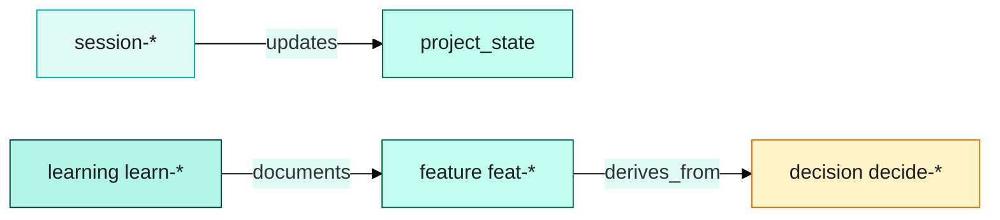
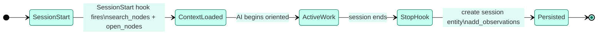

# The Claude Code Memory System: How We Gave an AI a Persistent Brain

Every time you start a new Claude session, you're talking to someone with amnesia.

It doesn't matter that yesterday you spent three hours explaining your project architecture, your naming conventions, the reasons behind every unusual decision in the codebase. Today, none of it exists. The assistant is sharp, capable, and knows absolutely nothing about your project. You're starting over.

We got tired of this. So we built a memory system that fixes it — and this article explains exactly how.

---

## The Amnesia Problem

Modern LLMs are stateless by design. When a session ends, context evaporates. The next session starts with a blank slate, and everything the model "knew" about your project exists only in your prompt.

This creates what we've started calling the **context tax** — the hidden overhead of re-establishing working knowledge at the start of every AI interaction.

The scale of this problem is larger than most developers realise:

- **200+ hours per year** spent re-explaining preferences and project context to AI assistants without persistent memory (Boost.space research)
- **66% of developers** report spending extra time fixing near-miss AI suggestions caused by missing context (Stack Overflow 2025)
- AI tools frequently behave "like a new contributor" — unaware of tacit knowledge about data interactions, backward compatibility requirements, or team conventions

Token economics make this worse. Loading 200,000 tokens of codebase context costs approximately **$0.30–$0.50 per session** (Claude Sonnet). For a 10-developer team running 10 sessions each per day, that's **$10,000–$18,000 per year in input tokens alone** — before any output, before any actual work gets done.

There's also a less obvious problem: even when you do load a large context, the model may not use it effectively. Research shows that accuracy drops more than **30% when relevant information sits in the middle of the context window** — the "lost in the middle" effect. The effective useful context is often far below the marketed maximum. More tokens doesn't automatically mean better recall.

The root cause is architectural. LLMs process context the same way RAM works — available while the session runs, gone when it ends. There's no persistent state, no learning across sessions, no memory that survives a window close.

Approaches like MemGPT (now Letta) have tackled this with hierarchical memory — a main context (what the model actively processes) backed by external storage that agents can page in and out via function calls. LangMem takes a different approach: post-session distillation, where key facts are extracted and consolidated after each conversation. Both are valid. We built something tuned specifically for software development workflows on top of MCP (Model Context Protocol) infrastructure we already had running.

---

## The Architecture: Three Layers

The architecture below shows how the three layers connect — hot context is always in the session, the Docker graph is queried on demand, and Obsidian provides human-readable archive.

> **Figure 1**: Three-layer AI memory architecture — open [`archives/diagrams/2026-04-30-three-layer-memory-architecture-draft.excalidraw`](archives/diagrams/2026-04-30-three-layer-memory-architecture-draft.excalidraw) in Excalidraw to view and edit.

Our memory system has three distinct layers, each serving a different purpose. Claude Code uses them in priority order: hot context first, graph lookup on demand, Obsidian for long-form reference.

### Layer 1 — Hot Context (injected at session start)

The fastest memory is the memory that's already in the prompt when the session starts.

We built a **SessionStart hook** that fires automatically before Claude responds to any message. It searches our Docker memory graph for the current project state and injects a structured summary — the "session memory block" — directly into the conversation context.

The block is token-budgeted at **~3,000 tokens**: enough to carry the essential state without crowding out working context. It includes:

- **Active memory lane**: which branch is currently checked out, what work is in progress, the last sync timestamp
- **Project state**: current phase, build status, test coverage, active blockers
- **Last 5 commits**: what changed recently
- **Key learnings and decisions**: the non-obvious patterns discovered in recent sessions

The loading is tiered by relevance. The active memory lane gets full detail. Paused lanes (other branches the team is working on) get compact summaries. Archived lanes appear only as references — enough to know they exist, not enough to crowd the context.

This hot context costs nothing extra at inference time — it's part of the initial prompt. And it means Claude arrives knowing the project state without any manual re-explanation.

### Layer 2 — Docker Memory Graph (search/load on demand)

Hot context carries the essential state. But a project accumulates far more knowledge than fits in 3,000 tokens: hundreds of architectural decisions, dozens of feature implementations, deep learnings about specific edge cases and gotchas.

For this, we run a **knowledge graph** as an MCP service inside Docker Compose. The service is `memory-reference`, exposed at `localhost:3100`, and it holds a typed entity graph.

Entities follow a strict naming convention:
- `project_state` — `electrical-website-state` (one per project)
- `feature` — `feat-phase-8-scrollreveal-production`
- `learning` — `learn-transforms-preserve-scroll-anchors`
- `decision` — `decide-section-container-pattern`
- `session` — `session-2026-04-20-001`

The relations below show how entity types connect — a session updates project state, a feature derives from a decision, and a learning documents a feature.

Each entity has typed observations (structured strings) and typed relations to other entities. A feature entity knows which decisions it derives from. A session entity knows which project state it updates. A learning entity knows which feature it documents.

Claude can search this graph at any time: `search_nodes("phase 8 tests")` returns a ranked list of relevant entities. `open_nodes(["feat-phase-8-scrollreveal-production"])` loads the full entity with all observations and relations.

This is **deterministic recall**, not probabilistic retrieval. The entity either exists or it doesn't. A search for `feat-phase-8` either finds the entity or it doesn't — there's no semantic drift, no "I think this might be relevant" approximation. We know exactly what we stored and exactly how to retrieve it.

**Why a knowledge graph instead of a vector database?**

Vector databases retrieve by similarity — fast, broad, and stateless. They're excellent for semantic search over large document collections. But they have no native concept of relationships. A vector search can tell you "feat-phase-8 is related to tests" — it can't tell you that feat-phase-8 *depends on* decide-section-container-pattern, which was *derived from* learn-css-variable-media-query-conflicts.

Knowledge graphs model that relational structure explicitly. We can ask: "What decisions were made that affected Phase 7?" and traverse the graph to find all `decide-*` entities linked to `feat-phase-7-animation-polish` via `derives_from` relations. That's multi-hop reasoning — something flat vector embeddings structurally cannot do.

Microsoft's GraphRAG research confirms this at scale: knowledge graph retrieval achieves **54.2% better accuracy than plain RAG** on average, and **86% vs 32%** on complex enterprise benchmarks.

The trade-off is discipline. Knowledge graph recall depends on consistent entity naming. We enforce strict kebab-case conventions and always search before creating (to avoid duplicates). It's a small overhead that pays dividends in every subsequent session.

### Layer 3 — Obsidian Long-Form Archive (human-readable)

The knowledge graph is queryable by Claude. But it's not human-readable in any meaningful sense. A developer joining the team can't browse Docker memory entities in a text editor.

For the human layer, we use **Obsidian** — a local markdown vault with the Local REST API community plugin enabled. The vault is structured using the PARA method: Projects, Areas, Resources, Archive. Under each project directory: `Research/`, `Decisions/`, `Daily Notes/`, `Sessions/`.

Claude writes to the vault through the REST API running on port 27124. A Docker proxy routes the API calls — Claude never touches the vault filesystem directly. This means the Obsidian integration works identically whether Claude is running on the same machine as Obsidian or via a containerised proxy.

What goes in Obsidian: long-form research notes, article drafts, implementation write-ups, architecture diagrams in markdown, session narratives that would be too verbose for a Docker entity. The article you're reading now, for example, lives in the vault under `Projects/Nexgen Electrical Innovations/Research/article-claude-code-memory-system.md`.

What does NOT go in Obsidian: session rehydration state, structured decisions, searchable learnings. That's Docker's job. Obsidian is the human-readable complement, not a replacement.

---

## The Session Lifecycle

The architecture only delivers value if it runs reliably every session, without manual intervention. Here's exactly what happens:

Every session follows the same deterministic path — hook fires, context loads, work proceeds, session entity persists.

**Session start:**
1. You run `git checkout feature-branch`
2. A `PostCheckout` hook fires automatically
3. The hook reads `config/active-memory-lanes.json`, finds the lane matching the checked-out branch, and sets it to `active`
4. The `SessionStart` hook fires before Claude's first response
5. It calls `search_nodes("electrical-website-state")` on the Docker graph, then `open_nodes(["electrical-website-state"])` to load current project state
6. The result is injected as the session memory block — branch, build status, phase, last commits, blockers
7. Claude begins the session already oriented

**During the session:**
Claude accumulates context normally. We don't write to Docker mid-session (it would create noise). Build gate checks (`pnpm typecheck && pnpm build`) run at logical checkpoints — before commits, before significant refactors.

**Session end:**
1. The `Stop` hook fires when the session closes
2. `memory-lane-stop.mjs` syncs the active lane state to `config/memory-lanes/[branch].json` — last sync timestamp, emergency summary
3. Claude creates a `session-YYYY-MM-DD-seq` entity in Docker with work completed, decisions made, next tasks
4. `add_observations` updates the project state entity with current branch, build status, next steps
5. New `learn-*` and `decide-*` entities are created for anything non-obvious that was discovered
6. Relations are wired: session → project_state (`updates`), learning → feature (`documents`), decision → feature (`derives_from`)

**Branch switching (Memory Lanes):**

This is where the system earns its keep for multi-branch development. Each branch has its own memory lane — a separate context bubble with its own history.

When you run `git checkout main`, the PostCheckout hook fires, pauses the current branch's lane, and activates the `main` lane. Claude's session memory block reflects the state of `main` — different branch, different active phase, different recent commits, different in-progress features.

Switch back to `feature-branch` and the lane resumes exactly where it left off. Zero context loss. The branch-specific history is preserved independently.

---

## Real Results

This isn't theoretical. We've been running this system in production across a real Next.js 16 + React 19 project.

**95% test coverage maintained across 120+ session handoffs.** The memory system meant each session could pick up testing exactly where the last one left off, without spending 20 minutes re-establishing which test cases existed and which were failing.

**Zero context loss on branch switches.** Before memory lanes, switching branches mid-feature meant explaining the feature context again from scratch. Now it's automatic.

**Phase 8 example:** 13 failing Playwright e2e tests were identified at the end of one session and stored in the session entity. The next session opened with the exact list of failing tests, root causes already partially diagnosed, and a clear next step. Total re-orientation time: under 2 minutes.

**MCP stack: 12 services, 70+ tools** — all discoverable by Claude through one aggregator endpoint. The aggregator pattern (a single HTTP server that routes tool calls to upstream MCP services) scales cleanly as new tools are added.

**Obsidian vault**: the full project history in human-readable PARA structure. Implementation write-ups, architecture decisions, research notes — all browsable by any team member, all searchable in Obsidian's native interface, all auto-written by Claude during sessions.

---

## This Pattern Is Not Claude-Specific

We want to be clear: **Claude Code is our implementation, not the only implementation**.

The three-layer architecture — hot context injection, knowledge graph lookup, human-readable long-form archive — applies to any AI-assisted development workflow. The specific components are swappable:

- Replace Claude Code with Cursor, Windsurf, or any MCP-compatible AI tool
- Replace the Docker memory-reference service with any MCP-compatible knowledge graph server
- Replace Obsidian with Notion, Roam, Logseq, or any markdown-compatible store

The key patterns to replicate are:

1. **Entity naming discipline** — consistent prefixes (feat-, learn-, decide-, session-), kebab-case, searchable specificity
2. **Session lifecycle hooks** — PostCheckout for lane management, SessionStart for context injection, Stop for persistence
3. **Tiered loading** — active context gets full detail; background context gets summaries; archives get references only
4. **Separation of concerns** — hot context for speed, graph for structure, long-form for humans

The architecture emerged from a real frustration with real costs. The 200+ hours per year of context re-establishment, the $10K–18K in annual token costs for context loading, the productivity compound loss when AI operates without memory of past decisions — these are real numbers affecting real teams.

We built this system to eliminate that overhead. It works. And the pattern is yours to apply.

---

## Getting Started

The minimal viable version of this stack is:

1. **A knowledge graph MCP service** — any service that implements `create_entities`, `search_nodes`, `open_nodes`, `add_observations` via MCP tool calling. The `memory-reference` service we use is one example; there are open-source alternatives including Zep, Mem0, and Graphiti.

2. **A SessionStart hook** — a shell script or Node script that searches the graph for project state and injects it as a system prompt prefix before the first AI response.

3. **A Stop hook** — a script that writes the session summary back to the graph as a `session-*` entity.

4. **Entity naming conventions** — decide your entity types and naming scheme before you start. Consistency is what makes retrieval reliable.

The full stack (Docker Compose, Obsidian integration, memory lane branch management, MCP aggregator) took us several weeks to build and refine. The minimal version can be operational in a day.

What you get in return is an AI assistant that remembers — not just what you told it, but what it discovered, what decisions were made and why, what patterns emerged across dozens of sessions. An assistant that treats your project as a living knowledge base rather than a blank slate it wakes up to every morning.

That's worth building.

---

*This article is part of the **ai-memory-architecture** series documenting our production implementation of persistent memory for AI-assisted software development.*
