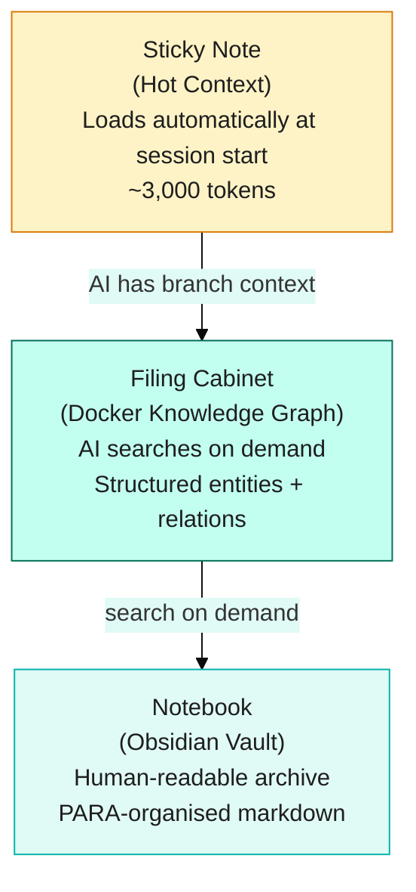
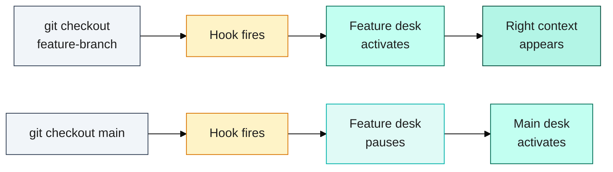
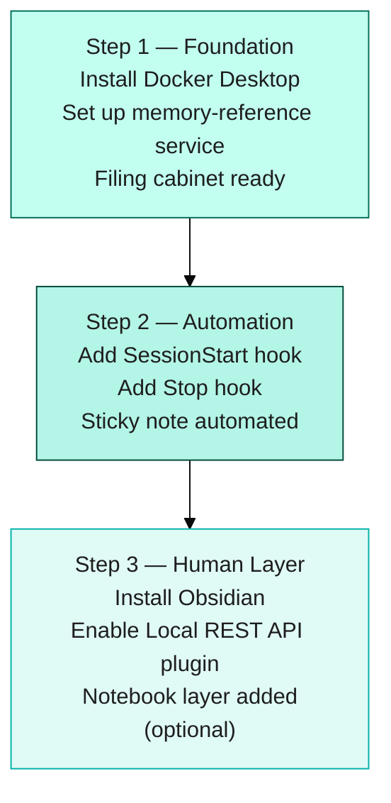

# How I Made My AI Coding Assistant Remember Everything: A Developer's Guide

## The Most Frustrating Part of Using AI

I'm going to describe a situation you've probably lived.

You spend an hour in a Claude or ChatGPT session getting it to understand your project. You explain the tech stack. You describe the naming conventions. You paste in the relevant files so it understands the context. It starts giving you genuinely useful suggestions — ones that actually fit your codebase. You make real progress.

Then you close the tab.

The next day, you open a new session. And you're back at square one. The AI has no idea what your project is, what you were working on, or what decisions you made yesterday. You have to explain everything again. From scratch.

A 2025 Stack Overflow survey found that 66% of developers spend extra time fixing AI near-misses, and 45% cite it as their top frustration. The experience feels like working with a new contributor every single day — someone brilliant, but with no institutional knowledge about your project, your conventions, or why you made the decisions you made.

I used to think I was doing something wrong. That there was some setting I was missing, or some prompt technique I hadn't learned yet.

There wasn't. This is just how AI assistants work by default. And once I understood *why*, I could actually fix it.

---

## Why AI Forgets (and Why That's Actually Fine)

Here's the honest explanation: AI language models don't have memory between sessions. It's not a bug — it's the architecture.

When you chat with an AI, it processes your entire conversation in something called a **context window** (think of it as the AI's working memory). It can hold a lot of information — a modern Claude session can handle hundreds of thousands of words. But when the session ends, that working memory is wiped. The next session starts completely fresh.

It's like this: imagine you have an incredibly capable co-worker who can focus completely on any problem you give them. But every morning, they wake up with no memory of yesterday. They're just as smart — maybe smarter — but they have to be caught up from scratch each time.

That's not a flaw. It's a design choice that makes AI systems scalable and consistent. The flaw is that most tools don't give you a way to bridge that gap.

Once I understood this, I stopped fighting the architecture and started building around it. The solution is a **persistent memory layer** — a system that stores what the AI needs to know and loads it back at the start of each session.

The good news: you don't need to be a systems engineer to set this up. The pattern is simpler than it sounds.

---

## The Three-Layer Solution

Three layers, three tools you already know — sticky note, filing cabinet, notebook. Here's how they work together:

Think of it like three tools you already know from the physical world.

### Layer 1: The Sticky Note (Hot Context)

This is the smallest layer — just the essential facts that get loaded automatically every time you start a session.

Imagine leaving a sticky note on your keyboard: *"Branch: main. Last task: fix the navbar bug. Next: write tests for the auth module."*

That's hot context. In practice, it's a small block of text (usually under 3,000 words — about 10 pages) that gets injected into the AI's context window before you even type your first message. It contains:

- What branch you're on
- What you were working on last session
- Any active blockers
- The next task

The magic: a small script called a **hook** (think: an automated note-taker) writes this sticky note at the end of each session and reads it back at the start of the next one. You don't have to remember to do it — it just happens.

### Layer 2: The Filing Cabinet (Docker Knowledge Graph)

This is the bigger, searchable layer — and it's where things get genuinely powerful.

**Docker** is a tool that runs small programs (called containers) on your computer in the background. One of those programs is a memory service — a searchable database of everything the AI has learned about your project.

You don't have to interact with Docker directly most of the time. Think of it as the filing cabinet in the back office: it's always there, and when the AI needs something, it goes and looks. It can search for things like:

- "What animation library did we decide to use?"
- "What was the Phase 7 work about?"
- "What's the convention for naming server actions in this project?"

Instead of storing information as a big text blob (like a long README), the filing cabinet uses a **knowledge graph** — a web of connected facts called *entities* and *relations*. An entity might be a feature, a decision, or a learning. Relations connect them: "feat-phase-8 was fixed by session-2026-04-20-001."

This structure means the AI can find specific information reliably, not just retrieve the most recently mentioned things. It's the difference between having a searchable database and having a pile of Post-it notes.

### Layer 3: The Notebook (Obsidian)

This is the human-readable layer — and it's optional, but it's what makes the whole system feel like a *second brain* rather than just a tool.

**Obsidian** is a note-taking app that stores everything as plain Markdown files on your computer. No cloud lock-in, no subscription required for the basics, just files you own.

In our setup, long-form notes, research write-ups, and decision logs live in Obsidian. The AI can read them via a plugin called the Local REST API — but more importantly, *you* can read them too. Open Obsidian and you've got a human-readable map of your entire project history.

The routing rule we follow: *"Would a developer search for this in six months? → Obsidian. Does the AI need to recall this next session? → Docker."*

Together, the three layers work like this:
- Session starts → sticky note loads automatically (Layer 1)
- AI needs specific context → searches the filing cabinet (Layer 2)
- You want to review project history → open the notebook (Layer 3)

---

## Memory Lanes: Never Lose Branch Context Again

Here's the feature that made me say "oh, that's clever."

If you work on multiple branches — which most teams do — you've probably hit this: you switch from your feature branch to a hotfix, and suddenly your AI has no idea what you were doing on the feature branch. The sticky note reflects the last branch you were on.

**Memory lanes** solve this by giving each branch its own context.

Think of it like having a separate desk for each task.

One git command, automatic context swap — the hook handles everything:

Your feature branch has its own desk with its own sticky notes, its own filing cabinet searches, its own history. When you `git checkout feature-branch`, your feature desk activates automatically. When you switch back to main, the main desk takes over.

This happens via a **PostCheckout hook** — a script that fires every time you change branches. It detects which branch you switched to, finds the matching memory lane, and activates it. No manual steps. The right context just appears.

For teams working on multiple features simultaneously, this is a game-changer.

---

## Getting Started: The Minimal Path

Three steps, each building on the last — you can stop at Step 1 and still have a working memory system:

You don't have to build all three layers at once. Here's how to start:

**Step 1 — Docker memory only (the foundation)**

Install Docker Desktop, then set up a memory-reference service (there are open-source MCP-compatible templates for this). This gives you the filing cabinet. Your AI can now store and retrieve structured knowledge about your project across sessions.

**Step 2 — Add session hooks**

Hooks are just config files that run scripts at specific moments: session start, session end, branch checkout. Add two: one that loads your project state at the start, one that saves it at the end. Your sticky note system is now automated. No manual intervention required.

**Step 3 — Add Obsidian (when you're ready)**

Once Docker memory is working, Obsidian is the optional upgrade. Install the app, install the Local REST API community plugin, add your API key to your environment config, and you're done. Your AI can now read and write to your vault, and so can you.

The whole pattern works with any AI tool that supports **MCP** (Model Context Protocol — the open standard for connecting AI tools to external services). Claude Code, Cursor, Windsurf, and others all support it. This is not Claude-specific.

---

## You've Got This

The amnesia problem feels fundamental — like something you just have to live with. It isn't. It's an infrastructure gap, and infrastructure gaps are solvable.

Start small: even just a simple project state entry that gets loaded at session start is better than nothing. Add the knowledge graph when you're ready. Add Obsidian when you want the human-readable layer.

The developers who get the most out of AI tools aren't the ones who accept the defaults — they're the ones who build the scaffolding that makes the AI actually useful across sessions. That's you now.
