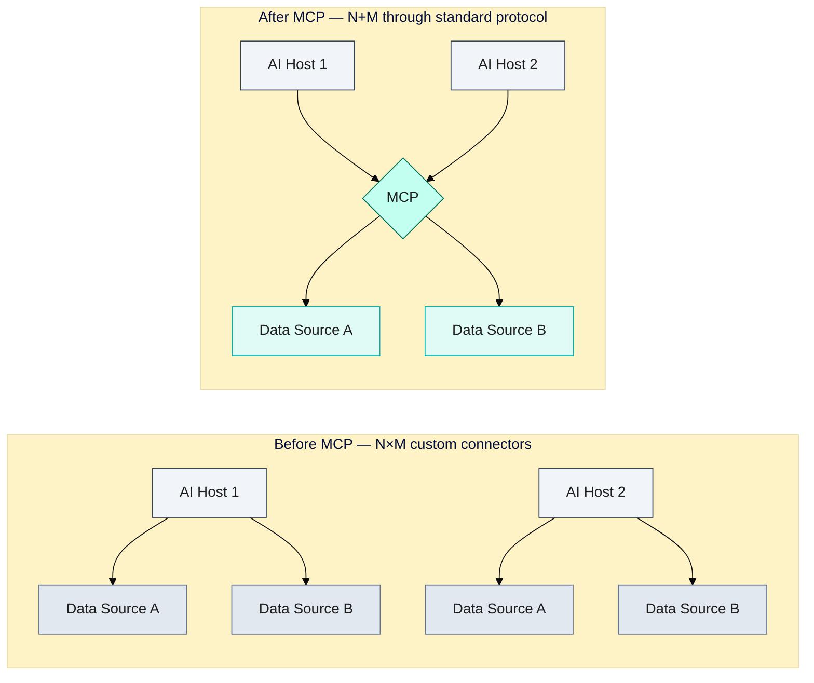
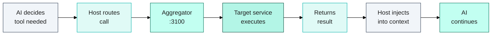

# MCP: The Protocol Making AI Tools Composable — and How We Built a 10-Service Memory Stack on Top of It

Before November 2024, integrating an AI assistant with your development tools was a bespoke, brittle exercise. Every tool — every IDE, every AI coding assistant — needed its own custom integration with GitHub, Jira, your database, your filesystem. Ten tools, ten custom connectors. Change one API and half your integrations break. The pattern was N×M: N AI hosts multiplied by M data sources, each pair requiring its own glue code.

Anthropic's Model Context Protocol changed that. MCP replaces N×M custom integrations with N+M: each tool implements the protocol once, and every MCP-compatible host can talk to every MCP-compatible server. In the eighteen months since launch, 97 million monthly SDK downloads and 10,000+ active public servers have validated the bet. This is how we built a 12-service AI memory stack on top of it — and why you should care.

---

## The N×M Integration Problem

The integration problem is geometric — each new AI host requires connectors to every data source, until MCP makes the cost additive rather than multiplicative:

The problem was more fundamental than connector maintenance. Each custom integration made architectural assumptions: this tool speaks REST, that one needs a webhook, this other one requires a long-lived WebSocket. Integrations weren't composable — you couldn't easily chain them, route between them, or swap one for another.

For AI coding assistants specifically, the problem compounded. An AI agent needs to read your codebase, query your issue tracker, search your documentation, run your tests, and write to your memory store — all in a single session. Implementing this required either a locked-in proprietary ecosystem (everything in one vendor's tools) or a custom integration layer maintained alongside the actual product.

The root cause was simple: there was no standard protocol. Every integration spoke its own language.

---

## How MCP Works

MCP is a client-server protocol built on JSON-RPC 2.0. The core model has three participants:

**Hosts** — AI applications that initiate connections. In practice: Claude Code, Cursor, Windsurf, VS Code Copilot, and any IDE or agent framework that implements the client side. The host manages connection lifecycle, routes tool calls to the appropriate server, and injects server-provided context into the model's context window.

**Servers** — Lightweight processes that expose tools, resources, and prompts. A server might expose five tools (read_file, write_file, search_files, list_directory, get_file_info) or fifty. Each tool has a name and a JSON Schema describing its parameters. Servers are stateless by design (per the November 2025 spec revision) — state lives in the host or an external store, not in the server process.

**Transport** — MCP is transport-agnostic. Servers can communicate via stdio (local subprocess), HTTP+SSE, or WebSockets. In our production stack, all 12 services communicate over HTTP with Server-Sent Events for streaming.

Every tool call follows the same four-hop path — the AI never touches a service directly; host and aggregator handle all routing:

When an AI session starts, the host discovers available tools from connected servers and injects their schemas into the model's context. When the model decides to use a tool, the host routes the JSON-RPC call to the appropriate server, which executes and returns a result. The model never talks to servers directly — the host is always the intermediary.

**Adoption timeline:**
- November 2024: Anthropic announces MCP as an open standard
- March 2025: OpenAI adopts across the Agents SDK and Responses API
- April 2025: Google DeepMind confirms support
- July 2025: Microsoft integrates MCP into Copilot Studio (45M downloads at announcement)
- November 2025: AWS adds support (68M downloads); MCP donated to the Linux Foundation AAIF, co-founded by Anthropic, Block, and OpenAI
- March 2026: 97M monthly SDK downloads; 10,000+ active public servers

The Linux Foundation donation is the signal that matters: MCP is now industry infrastructure, not a vendor feature.

---

## The Aggregator Pattern

Running twelve MCP servers doesn't mean registering twelve entries in your AI tool's configuration. The aggregator pattern solves this: a single HTTP gateway discovers tools from multiple upstream services and exposes them all through one endpoint.

Our implementation runs the aggregator at `localhost:3100`. Claude Code has exactly one MCP configuration entry pointing there. The aggregator handles everything else.

**Tool discovery** uses a two-pass strategy. First, the aggregator tries `GET /tools` on each upstream service — the simple REST approach. If that fails (service doesn't implement it), it falls back to `POST /tools/call` with a `list_tools` payload. Both paths are tried on startup and cached. The result: every tool from every service is available in the combined tool list within seconds of `docker compose up`.

**Tool namespacing** prevents collisions between services that expose similarly-named tools. Our naming convention: `mcp__MCP_DOCKER__{service_name}__{tool_name}`. So the `search_nodes` tool from our `memory-reference` service becomes `mcp__MCP_DOCKER__memory_reference__search_nodes`. The playwright service's `browser_navigate` becomes `mcp__MCP_DOCKER__playwright__browser_navigate`. There's no ambiguity, and the namespace immediately tells you which service is responsible.

**Caddy as API gateway** sits in front of the aggregator. We chose Caddy for its zero-config TLS, simple rate-limiting directives, and reliable health check integration. Rate limiting is configured per-service: high-frequency services (filesystem, memory) have generous limits; external API wrappers (GitHub, Obsidian) have conservative limits to avoid upstream throttling.

**Health-check cascade** is the piece that matters most in production. Caddy won't route to the aggregator until all 12 services report healthy. Services report health via lightweight HTTP endpoints. The aggregator itself reports healthy only when all downstream services are reachable. This cascade means `pnpm docker:mcp:smoke` (our health check script) gives a reliable pass/fail for the full stack.

---

## Building a Production MCP Stack

Our 12-service Docker Compose stack covers the full surface area of an AI coding session:

| Service | Purpose | Tools exposed |
|---------|---------|---------------|
| `memory-reference` | Knowledge graph (session state, decisions, learnings) | `search_nodes`, `open_nodes`, `create_entities`, `add_observations`, `create_relations` |
| `playwright` | Browser automation and visual verification | `browser_navigate`, `browser_snapshot`, `browser_take_screenshot`, + 15 more |
| `sequential-thinking` | Complex multi-step reasoning | `sequential_thinking` |
| `github-official` | All GitHub operations (PRs, issues, checks) | `create_pull_request`, `merge_pull_request`, `list_pull_requests`, + 20 more |
| `nextjs-devtools` | Build and type checking | `run_typecheck`, `run_build`, `get_build_errors` |
| `obsidian-vault` | Obsidian Local REST API proxy | `read_note`, `write_note`, `search_vault`, `list_vault_files` |
| `filesystem` | Structured file operations | `read_file`, `write_file`, `list_directory`, + 5 more |
| `fetch` | Authenticated HTTP requests | `fetch` |
| `context7` | Library documentation lookup | `resolve-library-id`, `query-docs` |
| `postgres` | Database operations | `query`, `describe_table`, + 3 more |
| `aggregator` | Tool discovery and routing | (internal) |
| `caddy` | API gateway, TLS, rate limiting | (infrastructure) |

The hub-and-spoke topology below shows how the aggregator connects all 12 services — a single Claude Code entry point fans out to the full tool surface:

> **Figure 2**: MCP Docker stack hub-and-spoke — aggregator at centre, 10 services as labelled spokes — open [`archives/diagrams/2026-04-30-mcp-twelve-service-hub-spoke-draft.excalidraw`](archives/diagrams/2026-04-30-mcp-twelve-service-hub-spoke-draft.excalidraw) in Excalidraw.

**Service registry via Docker hostnames.** Services communicate over Docker's internal network using container names as hostnames. The aggregator reaches `memory-reference` at `http://memory-reference:3001` — no Caddy round-trip, no external DNS. This keeps tool call latency in the single-digit milliseconds for local services.

**Configuration is declarative.** Adding a new service means appending a block to `docker-compose.yml`, adding its discovery URL to the aggregator config, and defining its health check endpoint. No code changes, no restarts of other services — just `docker compose up -d new-service` and it's available in the next Claude Code session.

**No vendor lock-in.** The aggregator speaks MCP regardless of which host connects. We've tested the same stack with Claude Code, Cursor, and a custom Python agent using the MCP Python SDK. The tools work identically. Switch your AI coding tool and your entire memory infrastructure comes with you.

---

## What This Enables

Seventy-plus tools accessible via a single Claude Code configuration entry. That number matters less than what it represents: the full operational surface of a software project, exposed through a consistent protocol to any AI agent we choose to run.

In practice, this means:
- **Session continuity.** The AI searches Docker memory (`mcp__MCP_DOCKER__memory_reference__search_nodes`) at session start, finds the project state entity, and begins with full context — branch, build status, active phase, outstanding decisions.
- **Verified changes.** Before committing, the AI runs typecheck and build via `mcp__MCP_DOCKER__nextjs_devtools__run_typecheck`. Failures block the commit. This isn't a prompt instruction — it's a tool call with a verifiable return value.
- **Human-readable archive.** After a session, decisions get mirrored to Obsidian via `mcp__MCP_DOCKER__obsidian_vault__write_note`. The knowledge graph holds structured data; the vault holds the narrative.
- **GitHub without shell access.** Every PR, merge, and CI check happens via `mcp__MCP_DOCKER__github_official__*`. No `gh` CLI, no token leakage in shell history.

The aggregator pattern is the enabling abstraction. Without it, twelve services would require twelve configuration entries, twelve authentication setups, and twelve points of failure. With it, the AI tool sees one endpoint. The infrastructure team manages the rest behind the gateway.

MCP is young — the spec hit 1.0 less than eighteen months ago. But the adoption curve and the Linux Foundation stewardship tell the same story: this is the integration layer that AI development has needed. Build your tooling on it now, and every AI tool that matters will be able to use it.

**Production reliability — three commercial migrations, zero MCP failures:**

The stack described above has run reliably across three consecutive commercial project migrations: DHL Reading (PRs #119, #120), Medivet Watford (PR #121), and Ladbrokes Woking (PR #122). Each migration ran end-to-end through the aggregator at `localhost:3100` — memory-reference for session context, github-official for PR creation and CI monitoring, playwright for E2E verification, nextjs-devtools for build gate (63/63 pages on the Ladbrokes build), sequential-thinking for complex briefing tasks, and filesystem for rename operations. Zero MCP service failures across all three migrations. The health-check cascade worked as designed: `pnpm docker:mcp:smoke` reported green before every agent dispatch, and every tool call returned a clean result.

---

*The architecture described here is protocol-agnostic. Claude Code is our MCP host; the memory stack works with any MCP-compatible tool. The Docker Compose configuration and aggregator pattern are available as a reference implementation.*
