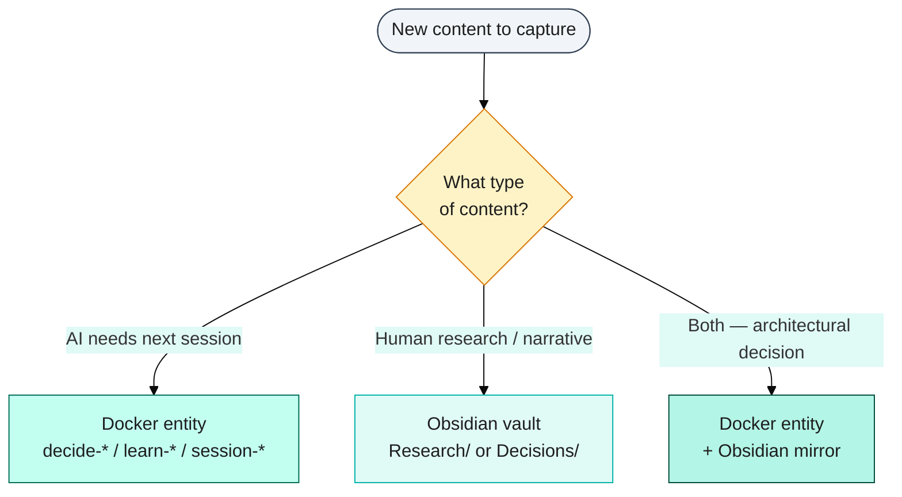

# Building a Platinum Second Brain: Obsidian + Docker + Claude Code

## Outline

- The Problem With Forgetting — two amnesias (yours and the AI's)
- BASB + Zettelkasten: The Foundation PKM frameworks bring to this problem
- Our Three-Layer Architecture — hot context / Docker graph / Obsidian vault
- The Session Bridge — lifecycle hooks that tie it all together
- Building Your Own — minimal start to full implementation

## Draft

David Allen famously said: "Your mind is for having ideas, not holding them." The entire personal knowledge management (PKM) movement grew from that insight. Stop using your brain as a hard drive. Build an external system that reliably stores, organises, and surfaces what you know — so your mind is free to do what it's best at: thinking.

We've applied the same principle to AI. And it changes everything.

---

## The Problem With Forgetting

Every developer who uses an AI coding assistant knows the ritual. You open a new session, type a prompt, and immediately realise: the AI has no idea who you are. No idea what you built yesterday. No memory of that architectural decision you spent two hours debating last week. No recollection of the naming convention you agreed on two months ago.

This is not a flaw in the AI. It's a design constraint. Large language models have no persistent state between sessions. Everything they know about your project comes from what you inject into the current context window. When the session ends, it's gone.

This is the first forgetting problem: **the AI's amnesia**.

But there's a second, less-discussed problem. When your AI helps you make a decision — say, why you chose knowledge graphs over vector databases for session memory — do *you* remember it six months later? Do you know where to find it? Can your teammates access it?

This is **your amnesia**: the tacit knowledge that accumulates in conversations, gets used once, and then dissolves.

Traditional PKM systems — Tiago Forte's Building a Second Brain, Niklas Luhmann's Zettelkasten — are designed to solve your forgetting. But they were built for human memory patterns. They don't know that an AI needs to read your notes too.

What we built solves both amnesias simultaneously. A second brain designed for two minds: yours and the AI's.

---

## BASB + Zettelkasten: The Foundation

In 2022, Tiago Forte published *Building a Second Brain*. It has since sold over 500,000 copies in 25 languages — remarkable for a book about note-taking. Its central argument: knowledge work has a capture problem. We consume enormous amounts of information but retain almost none of it in a form that's useful later.

Forte's solution is the **PARA method**: four folders that organise all digital information by actionability.

- **Projects** — active, goal-bound work with a clear end date
- **Areas** — ongoing responsibilities without a finish line (your health, your finances, your team)
- **Resources** — reference material you might need in the future
- **Archive** — everything inactive, kept for search but out of your daily view

Paired with PARA is the **CODE workflow**: Capture → Organise → Distill → Express. Don't try to write the perfect note on first capture. Save the raw thing. Then organise it into PARA. Then distill it — highlight the most important parts, then summarise those highlights. Then express: write something with what you've learned.

Zettelkasten takes a different approach. Where PARA is top-down (you decide where everything goes), Zettelkasten is bottom-up. Every note is atomic: one idea, one note, with a unique identifier. Notes link to each other by association, not by folder. Structure emerges from connections rather than being imposed from the start.

Originated by German sociologist Niklas Luhmann, who used index cards to write 90 books and 400 articles over his career, Zettelkasten excels at generating novel insights. PARA excels at getting things done. They're not competing systems — they're complementary. Use PARA for your file organisation; use Zettelkasten's linking philosophy for your thinking layer.

For our purposes, the combination gives us something specific: **PARA gives us the folder structure; Zettelkasten gives us the linking philosophy**. And when we apply both to an AI-integrated knowledge system, we get what we call a Platinum Second Brain — not just a personal knowledge system, but one that's actionable by both humans and AI.

---

## Our Three-Layer Architecture

The architecture below shows how the three layers stack — hot context at session-start, Docker knowledge graph for structured AI recall, and the PARA-organised Obsidian vault for human-readable long-term storage.

> **Figure 1**: Platinum second brain architecture — Hot Context, Docker Knowledge Graph with 5 entity types, and Obsidian PARA vault — open [`archives/diagrams/2026-04-30-para-layered-second-brain-draft.excalidraw`](archives/diagrams/2026-04-30-para-layered-second-brain-draft.excalidraw) in Excalidraw.

We built our implementation on three layers. Each layer serves a different audience and purpose.

**Layer 1: Hot Context (~3,000 tokens)**

Every session starts with a memory injection. At session start, a hook fires automatically and loads the most essential project context directly into the conversation. This is the "hot" layer — always present, always current, always small.

Three thousand tokens is enough for: current branch and build status, the top 3 next tasks, any active blockers, the last session summary, and the single most important architectural decision. Nothing more.

The constraint is intentional. Load too much and the AI's effective attention degrades. Load too little and it rebuilds context from scratch. Three thousand tokens is the sweet spot — enough for continuity, small enough for full attention.

**Layer 2: Docker Knowledge Graph (structured, AI-searchable)**

The middle layer is a knowledge graph running in Docker: a memory-reference MCP service that stores named entities connected by typed relations.

Entities follow strict naming conventions: `feat-*` for features, `learn-*` for technical learnings, `decide-*` for architectural decisions, `session-*` for session handoffs. Each entity has observations — an array of strings the AI can search and read.

This layer is designed for the AI. It's structured, searchable by keyword, and queryable by relationship. When the AI needs to recall why we chose a particular approach, it searches Docker for `decide-` entities. When it needs implementation detail for a past feature, it opens the `feat-` entity. The graph knows not just facts, but how facts relate to each other.

**Layer 3: Obsidian Vault (human-readable, PARA-organised)**

The top layer is Obsidian: a local Markdown vault organised by PARA. Research notes live in `Research/`. Architectural decisions have mirrors in `Decisions/`. Daily work journals go in `Daily Notes/`. Completed phases move to `Archive/`.

This layer is designed for humans. Obsidian's visual graph shows how notes connect. Backlinks let you navigate from a decision to every note that references it. Markdown is readable without any special tool, exportable to any format, and Git-trackable for team sharing.

**The routing table**

| Content type | Where it goes | Why |
|---|---|---|
| Session state, next tasks | Docker `project_state` entity | AI reads this every session |
| Architectural decisions | Docker `decide-*` + Obsidian `Decisions/` | AI + human both need these |
| Long-form research notes | Obsidian `Research/` | Too verbose for Docker; no session-start value |
| Daily work journals | Obsidian `Daily Notes/` | Chronological, human-only, narrative |
| Technical learnings / gotchas | Docker `learn-*` | AI needs to recall these during implementation |
| Completed features | Docker `feat-*` + optional Obsidian mirror | AI needs the impl detail; human benefits from narrative |

The routing decision tree makes the rule operational — apply it whenever new knowledge needs to be captured:

The rule we use to decide: *Would a developer search for this in six months?* → Obsidian. *Does the AI need to recall this in the next session?* → Docker.

---

## The Session Bridge

The two layers — Docker and Obsidian — are connected by lifecycle hooks. These run automatically; no manual intervention required.

**At session end**, a Stop hook fires. It runs `memory-lane-stop.mjs`, which syncs the current memory lane (think: a branch-aware context envelope) and records a session summary. Then Claude creates a Docker session entity — `session-YYYY-MM-DD-NNN` — with what was completed, what was decided, and what comes next. Optionally, the human adds a narrative note to Obsidian's daily note: what it felt like, what surprised them, what questions remain.

**At session start**, a SessionStart hook fires. It reads the current project state from Docker and injects the essential facts into the conversation context — the hot layer. By the time you type your first prompt, Claude already knows: you're on branch `feat/navbar-fix`, the build is passing, and the last session left off debugging hash navigation in `NavbarClient`.

The session bridge is a closed loop — what gets persisted at session end becomes the context that starts the next session:

```mermaid
%%{init: {"theme": "base", "themeVariables": {"primaryColor": "#c2fff1", "primaryBorderColor": "#006e56", "secondaryColor": "#e0faf6", "tertiaryColor": "#fef3c7"}}}%%
flowchart LR
    A[Stop Hook\nfires]:::amber --> B[memory-lane\n-stop.mjs syncs]:::slate --> C[Claude creates\nsession entity]:::cyan --> D[add_observations\nto project_state]:::deep --> E[SessionStart\nHook fires]:::amber --> F[Context\ninjected]:::teal --> G[AI begins\nsession oriented]:::cyan

    classDef cyan fill:#c2fff1,stroke:#006e56,color:#1e1e1e
    classDef teal fill:#e0faf6,stroke:#00b2a9,color:#1e1e1e
    classDef deep fill:#b3f5e6,stroke:#004a3a,color:#1e1e1e
    classDef amber fill:#fef3c7,stroke:#d97706,color:#1e1e1e
    classDef slate fill:#f1f5f9,stroke:#334155,color:#1e1e1e
```

In practice, it feels like this. You open a new session and ask: "Where did we leave off with the navbar issue?" Claude says: "The last session resolved the `pushState` vs `location.hash` issue. The fix replaced `window.history.pushState()` with `location.hash` assignment to ensure `hashchange` events fire correctly. All 13 e2e tests now pass."

That's not a lucky response. That's a session entity in Docker, loaded at start, serving its purpose.

**The human narrative layer**

Obsidian fills in what Docker can't. Docker is compact and structured; it doesn't hold the 800-word analysis of three alternative approaches you considered before making a decision. That lives in `Research/decide-navbar-hash-navigation.md` — linked from the decision entity, readable in Obsidian with full formatting, cross-linked to related notes.

**The team dimension**

Docker is per-developer session state. Obsidian is shareable. Install the Obsidian Git plugin, connect to a private GitHub repo, set a 30-minute auto-push interval, and your Obsidian vault becomes the team's living knowledge base. New team members don't get a wall of Confluence pages — they get a linked, searchable vault of every decision, every research note, every pattern the team has discovered.

---

## Building Your Own

You don't need our exact stack. The pattern works with any AI development workflow.

**The minimal version** needs three things: a persistent memory store (a Docker container running a knowledge graph MCP service works well), session lifecycle hooks (a startup hook to inject context, a stop hook to persist it), and a naming convention for entities. That's it. No Obsidian required for step one.

**The full version** adds Obsidian when you're ready for the human-readable layer. Install Obsidian, enable the Local REST API community plugin, add the API key to your environment, and point your stop hook at the REST API to write session summaries and decision mirrors automatically.

**Key conventions to adopt from day one:**

- Entity naming: `kebab-case` with type prefixes (`feat-`, `learn-`, `decide-`, `session-`)
- Token budget: keep your hot layer under 3,000 tokens; structure everything else for on-demand retrieval
- PARA for vault: Projects = active branches, Areas = ongoing conventions, Resources = Research/, Archive = completed phases
- The routing rule: Docker for the AI, Obsidian for the human, both for decisions

**The AKM horizon**

We're building toward what researchers are calling Agentic Knowledge Management (AKM): AI agents that proactively surface relevant knowledge before you ask. Agents that notice you're working on a component and pre-load the relevant decisions, learnings, and prior implementations — without you asking.

The architecture we've described is the foundation for that. Three layers, two audiences, one coherent system. A second brain that remembers for both of you.

David Allen said your mind is for having ideas, not holding them. We'd extend that: your AI's mind is for generating ideas, not holding context. Build the system that handles the holding — for both minds — and you free both to do what they're best at.

---

*Part of the [ai-memory-architecture] series. Next: "Memory Lanes: How We Gave Our AI Context-Switching Superpowers for Multi-Branch Development."*
