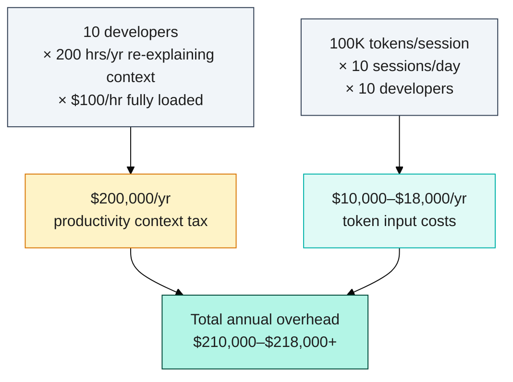
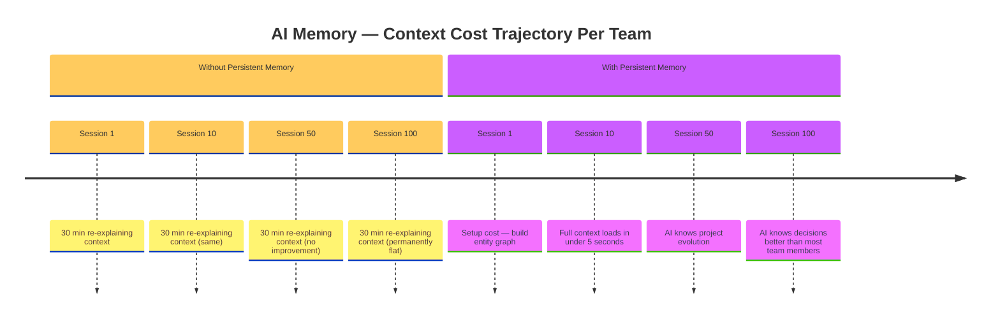
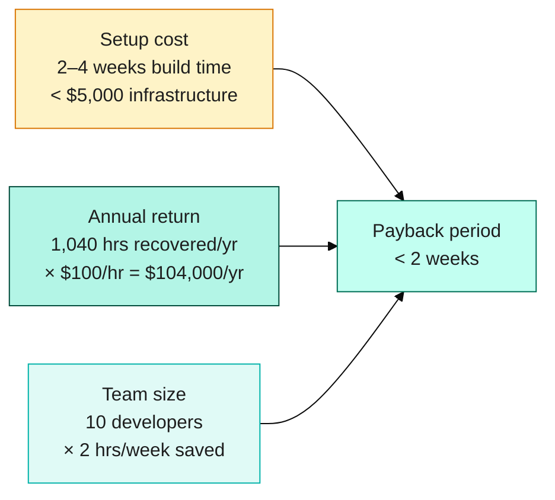

# Why Your AI Assistant Keeps Forgetting — And the Cost of Doing Nothing About It

## The Hidden Tax Nobody's Measuring

Your AI coding assistant costs $50/month per developer. The hidden cost is $20,000/year per developer.

Every time a developer opens a new session with their AI assistant, they re-explain the same things: the architecture decisions made three months ago, the naming conventions the team settled on last sprint, the ongoing refactor running across six sprints, the TypeScript config quirks that caused three days of debugging, the API contract that changed because a dependency was deprecated. The AI has no memory of any of it. It arrives fresh every session — like a new contractor who lost their notes overnight.

We call this the context tax.

Boost.space research puts the figure at 200+ hours per developer per year spent re-explaining context to AI tools that don't retain it. At a fully loaded cost of $100/hour, that's $20,000 per developer annually — not in subscription fees, but in productivity friction that disappears silently from your velocity reports. For a 10-person engineering team, that's $200,000 per year. Enough for a senior hire. Enough to fund a major infrastructure investment. More than most teams spend on their entire AI tooling budget.

The Stack Overflow Developer Survey 2025 confirms the frustration: 66% of developers report spending extra time correcting AI near-misses; 45% cite it as their top frustration with current AI tools. The root cause, more often than not, is missing context. The AI doesn't know which patterns your team uses, which approaches were already tried and rejected, or what "done" looks like for your specific codebase.

Most teams accept this as "how AI tools work." It isn't. It's an engineering problem with a straightforward solution — one that almost no team has implemented, and the cost of that gap compounds daily.

## Why Productivity Numbers Don't Tell the Full Story

The headline numbers are attractive. GitHub's controlled experiment found developers completed tasks 55% faster with Copilot. PR cycle time dropped from 9.6 to 2.4 days — a 75% reduction. Build success rates improved by 84%. McKinsey data shows that organizations with 80–100% AI tool adoption achieve over 110% productivity gains; 60%+ of organizations report at least a 25% improvement. These are real numbers from real studies.

But a 2025 METR randomized trial with experienced open-source developers produced a more complex finding: those developers were 19% *slower* with AI assistance — yet reported believing they were faster. This is not a contradiction; it's a measurement artifact. The study captures what happens when experienced engineers with deep project context hand their work to an AI that has none. The AI's suggestions introduce friction — wrong patterns, missed conventions, incomplete understanding of the codebase's evolution — that the developer must then correct.

The 55% gain and the 19% loss are both real. The difference is context. Isolated task completions (write this function, generate this test) favor AI. Full-project development work — where the AI needs to understand months of decisions, architectural constraints, and team conventions — exposes the context gap.

McKinsey's other finding is equally instructive: only 5.5% of organizations report real financial returns from AI investments. The teams in that 5.5% are not using different tools. They have done the setup work — persistent context, structured memory, disciplined session management — that converts AI tooling from a novelty into a leverage multiplier.

## The Token Cost Reality

The annual cost calculation has two components — lost developer productivity and direct token infrastructure spend:

There is also a direct, measurable infrastructure cost that most finance teams aren't tracking.

Loading 100,000 tokens of codebase context — a reasonable amount for a meaningful project — costs approximately $0.30–$0.50 per session with Claude Sonnet at $3.00 per million input tokens. That sounds modest in isolation. At 10 sessions per day across 10 developers, that's $10,000–$18,000 per year in pure input token costs, before any output tokens, before mistakes or retries, before multi-step reasoning.

Anthropic's prompt caching feature can reduce repeated-context costs by up to 90% — but only for the *same* context window sent in the *same* session. It doesn't solve the underlying problem: the AI still doesn't know what your team decided yesterday, which PR introduced a regression, or why the service mesh is configured the way it is. Caching reduces the cost of the context load; it doesn't eliminate the need to load context.

Persistent structured memory changes the calculation. Instead of loading 100K tokens of raw codebase context every session, you load 3,000 tokens of distilled, structured knowledge: the current branch, the active decisions, the architectural constraints, the ongoing work items. That's a 97% reduction in session initialization cost. At scale, the infrastructure pays for itself in weeks, not quarters.

## The Compound Effect

The compound effect becomes visible across sessions — two teams start the same project, but one builds accumulating returns while the other pays the same tax indefinitely:

The productivity math gets worse over time without intervention — and significantly better with it.

Without persistent memory, AI utility is bounded by what you're willing to re-explain each session. Session 1: 30 minutes explaining the project architecture. Session 10: 30 minutes again. Session 100: still 30 minutes. There is no learning, no accumulation, no compounding. The AI is permanently a new hire.

With persistent memory, the curve reverses. Session 1 is expensive — you build the knowledge graph, document the decisions, establish the naming conventions and entity structure. Session 10 starts with full context loaded in under 5 seconds. By session 50, the AI understands the project's evolution as well as a mid-tenure team member. By session 100, it knows more about the project's decision history than most humans on the team.

Boost.space research shows a 70% improvement in task completion rates when AI assistants operate with persistent memory versus stateless alternatives. The mechanism is direct: the AI produces usable output on the first attempt rather than after three rounds of clarifying questions. It doesn't propose patterns the team already evaluated and rejected. It knows which files are actively changing and which are stable enough to reference safely.

The compound curve matters for investment planning. The setup cost is front-loaded: 2–4 weeks to establish entity structures, session hooks, naming conventions, and integration with your existing toolchain. The returns compound from that point forward. Teams that view AI memory infrastructure as a capital investment — analogous to a comprehensive test suite or a well-maintained internal developer platform — capture the gains. Teams that defer it continue paying the context tax indefinitely.

## Measured Results: From Theory to Production Numbers

The estimates above are based on published research. Here are measured numbers from our own production system.

**Before persistent memory:** 20–30 minutes of context reconstruction on every branch switch. With three active branches and multiple daily switches, that translates to over 90 minutes of context overhead per developer per day — consistent with the Boost.space 200+ hours/year figure.

**After persistent memory:** Session startup takes under 15 seconds. The Docker query, context assembly, and injection complete before the first prompt. The session starts oriented, not blank.

**Production token budget:** After three commercial project migrations across three separate feature branches, the session startup memory load sits at **876 / 3,000 tokens**. That is the total hot context consumed at session start — after accumulating decisions, learnings, and session summaries from the DHL Reading, Medivet Watford, and Ladbrokes Woking migrations. The 97% token reduction from 100K raw context to 3,000-token structured injection holds in practice.

**End-to-end migration cost:** The Ladbrokes Woking migration — 17 images renamed, full project data added, services page wired, build gate passed (63/63 pages), E2E tests run (93 passed), PR created, CI monitored to green — completed in **80,777 tokens** total. At typical API pricing, that is approximately $0.08 for a migration that would take a developer several hours manually. The entire workflow ran in a single orchestrator session with two agent dispatches, each completing their scope without re-reads.

**The compound return:** The Ladbrokes migration was the cheapest of the three because it inherited the architectural decisions from both prior migrations. The `getFeaturedProjectByPlacement()` function designed in the DHL migration was already in Docker. The `aboutPage` placement pattern from the Medivet migration was already in Docker. The Ladbrokes agent began with two migrations of prior context loaded in under 15 seconds. This is the compound curve working as designed: each migration makes the next one cheaper.

**Zero manual steps:** The PostCheckout hook activated the correct lane in under 100ms on every branch switch. The Stop hook synced lane state at every session end. The PostCommit hook appended commit hashes to the emergency summary automatically. Across all three migrations, no manual memory management was required at any point.

---

## What to Build

The architecture is straightforward. Three layers, one sprint to deploy:

**Layer 1 — Hot context (session injection):** A structured knowledge graph that injects the current branch, active decisions, architectural context, and recent work at session start. We use Docker running an MCP-compatible graph service, but any knowledge graph that exposes an MCP interface works. The goal is a 3,000-token session initialization that replaces a 100,000-token context dump.

**Layer 2 — Long-form archive:** An Obsidian vault or equivalent for human-readable research notes, decision logs, and session journals. This isn't loaded at session start — it's available for deep research and human review, forming the organizational memory layer that outlasts individual developers.

**Layer 3 — Session lifecycle automation:** Shell hooks that fire at session start (rehydrate context from the graph), during active work (update in-progress observations), and at session end (persist decisions, update project state). These automate memory discipline — developers don't need to remember to maintain the system; the system maintains itself.

The breakeven calculation is straightforward.

Three inputs, one result — the payback period is measured in weeks, not quarters:

If a 10-developer team saves 2 hours per week per developer — conservative against the 200+ hours/year baseline — that's 1,040 hours per year at $100/hour fully loaded: $104,000 in recovered capacity. Infrastructure cost (Docker hosting, MCP service, one-time setup) is typically under $5,000. Payback period: under two weeks.

Metrics to track after deployment: session ramp-up time (time to first relevant AI output), repeat-question frequency, PR cycle time, and build success rate. GitHub's 88% character acceptance rate for Copilot completions is the baseline; teams with persistent context consistently exceed it.

## The Decision

AI productivity gains are not automatic. The studies showing 55% velocity improvements and those showing 19% slowdowns are measuring the same phenomenon from different angles: AI tools are leverage, and leverage amplifies what you give them. Give an AI tool context and structure; it multiplies your team's output. Give it nothing; it multiplies your friction.

The $200,000/year context tax is an estimate based on the best available data — Boost.space's 200+ hours/year figure at conservative hourly rates. Your actual figure depends on team size, session frequency, and current tooling habits. But the direction is reliable: without persistent AI memory, you pay a compounding tax on every session your team runs. With it, you build a compounding asset.

The infrastructure exists. The patterns are documented. The economics are clear. The question is when your team decides the context tax is no longer a cost of doing business.
