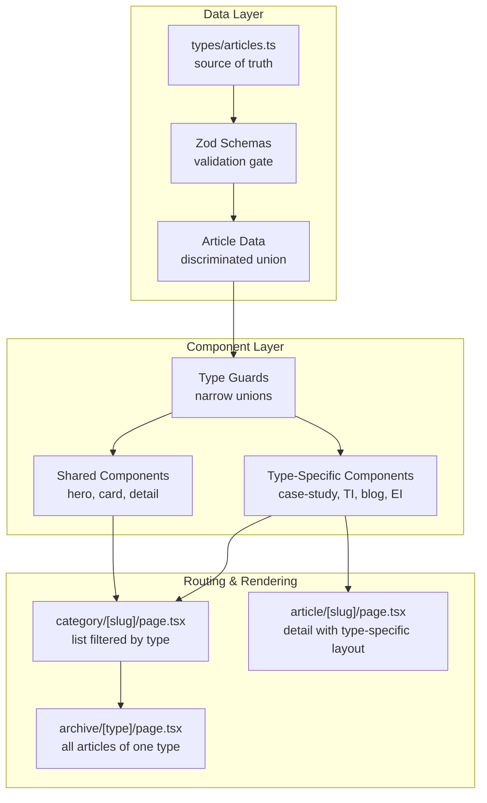

# V0S: Multi-Article-Type News Hub System — 2026-03-30

**Status:** Production-Ready Specification  
**Version:** 1.0  
**Last Updated:** March 30, 2026  
**Audience:** AI agents, developers  
**Deployment Target:** Vercel (production), Docker Desktop (local dev)

---

## Table of Contents

1. [Executive Summary](#executive-summary)
2. [Understanding the System](#understanding-the-system)
3. [Mandatory Rules](#mandatory-rules)
   - [TypeScript & Type Safety](#typescript--type-safety)
   - [Discriminated Unions](#discriminated-unions)
   - [Zod Validation](#zod-validation)
   - [Component Architecture](#component-architecture)
   - [Polymorphic Factory](#polymorphic-factory)
   - [ISR & Caching](#isr--caching)
   - [File Organization](#file-organization)
   - [Exports](#exports)
   - [Animation & Motion Standards](#animation--motion-standards)
   - [Comprehensive Seed Content & Showcase Coverage](#comprehensive-seed-content--showcase-coverage)

4. [File Structure](#file-structure)
5. [Implementation Checklist](#implementation-checklist)
6. [Component Implementation Guides](#component-implementation-guides)
7. [Data Schema Definitions](#data-schema-definitions)
8. [Routing Implementation](#routing-implementation)
9. [Type Guards & Utilities](#type-guards--utilities)
10. [SEO & Metadata](#seo--metadata)
11. [Migration Path](#migration-path-old--new)
12. [Testing Strategy](#testing-strategy)
13. [Performance Checklist](#performance-checklist)
14. [Going Live Checklist](#going-live-checklist)
15. [Continuation Points](#continuation-points)

---

## Executive Summary

### Problem Statement

The current news-hub system uses a monolithic `NewsArticle` type where all article categories (case studies, technical insights, blog posts, electrical insights) share identical properties. This forces:

- Unnecessary optional fields across all article types
- No type safety for category-specific rendering logic
- Unclear contracts between components and data
- Difficult-to-maintain polymorphic rendering

### Solution

Implement a **discriminated union** system with four specialized article types:

1. **CaseStudy** — Outcome-led delivery breakdowns (metrics, spotlight, ROI)
2. **TechnicalInsight** — Strategic commentary from the field (research, analysis depth)
3. **BlogPost** — Educational, narrative-driven content (series, timestamps)
4. **ElectricalInsight** — Market intelligence & design guidance (standards, regulations)

### Key Wins

- **Type Safety:** TypeScript enforces correct properties per article type
- **Performance:** Type guards eliminate runtime checks; tree-shake unused code
- **Scalability:** Adding a new article type requires only one new discriminated type + one new component set
- **Maintainability:** Clear separation of concerns; each type has its own view hierarchy
- **SEO:** Unique structured data per type; custom OG image generation
- **ISR Strategy:** Per-type revalidation timing based on change frequency

### Timeline

- **Phase 1–2:** Base types + Zod schemas + shared components (1–2 hours)
- **Phase 3–6:** Type-specific components (3–4 hours)
- **Phase 7–9:** Routing + migration + polymorphic updates (2–3 hours)
- **Phase 10:** Testing + validation (1–2 hours)
- **Total:** ~7–11 hours end-to-end

---

## Understanding the System

### Architecture Overview



### Article Types & Characteristics

| Type                  | Use Case                             | Distinguisher                | Key Fields                                                      | ISR Revalidate              |
| --------------------- | ------------------------------------ | ---------------------------- | --------------------------------------------------------------- | --------------------------- |
| **CaseStudy**         | Outcome-led delivery breakdowns      | `type: "case-study"`         | `metrics`, `spotlight`, `roi`, `duration`, `client`             | 7 days (infrequent changes) |
| **TechnicalInsight**  | Strategic commentary, research       | `type: "technical-insight"`  | `researchDepth`, `standards`, `references`, `complexity`        | 3 days (periodic updates)   |
| **BlogPost**          | Educational, narrative-driven        | `type: "blog-post"`          | `series`, `seriesPosition`, `relatedTopics`, `readTime`         | 1 day (regular posts)       |
| **ElectricalInsight** | Market intelligence, design guidance | `type: "electrical-insight"` | `regulations`, `industryFocus`, `applicability`, `lastReviewed` | 14 days (compliance-driven) |

### Component Hierarchy

```
components/news-hub/
├── shared/
│   ├── hero-section.tsx
│   ├── card-shell.tsx
│   ├── detail-layout.tsx
│   ├── meta-bar.tsx
│   ├── related-articles.tsx
│   └── cta-section.tsx
├── case-study/
│   ├── hero.tsx
│   ├── card.tsx
│   ├── detail.tsx
│   ├── metrics-showcase.tsx
│   ├── roi-breakdown.tsx
│   └── client-spotlight.tsx
├── technical-insight/
│   ├── hero.tsx
│   ├── card.tsx
│   ├── detail.tsx
│   ├── research-panel.tsx
│   ├── standards-guide.tsx
│   └── references-list.tsx
├── blog-post/
│   ├── hero.tsx
│   ├── card.tsx
│   ├── detail.tsx
│   ├── series-nav.tsx
│   ├── table-of-contents.tsx
│   └── author-bio.tsx
├── electrical-insight/
│   ├── hero.tsx
│   ├── card.tsx
│   ├── detail.tsx
│   ├── regulation-checklist.tsx
│   ├── applicability-matrix.tsx
│   └── compliance-notes.tsx
└── factory/
    └── polymorphic.tsx
```

### Data Flow

```
/data/news/articles/
  ├── case-studies.ts (array of CaseStudy)
  ├── technical-insights.ts (array of TechnicalInsight)
  ├── blog-posts.ts (array of BlogPost)
  └── electrical-insights.ts (array of ElectricalInsight)

    ↓ (union into allNewsArticles)

/types/articles.ts
  └── NewsArticleType = CaseStudy | TechnicalInsight | BlogPost | ElectricalInsight

    ↓ (validate with Zod)

/lib/articles/validate.ts
  └── articleSchema.parse(data)

    ↓ (narrow with type guards)

/lib/articles/type-guards.ts
  ├── isCaseStudy(article)
  ├── isTechnicalInsight(article)
  ├── isBlogPost(article)
  └── isElectricalInsight(article)

    ↓ (render with type-specific factory)

/components/news-hub/factory/polymorphic.tsx
  ├── forListView(article)
  └── forDetailView(article)

    ↓ (component receives correct type)

CaseStudyCard | TechnicalInsightDetail | BlogPostHero → rendered with type-safety
```

### Router Structure

```
app/
├── news-hub/
│   ├── page.tsx                    (hub landing, lists all articles)
│   ├── category/
│   │   └── [slug]/
│   │       ├── page.tsx            (filtered by category, shows all types)
│   │       ├── layout.tsx
│   │       └── not-found.tsx
│   ├── article/
│   │   └── [slug]/
│   │       ├── page.tsx            (detail view, route to type-specific component)
│   │       ├── layout.tsx
│   │       └── not-found.tsx
│   └── archive/
│       └── [type]/
│           ├── page.tsx            (all articles of one type)
│           └── [page]/
│               └── page.tsx        (paginated)
```

---

## Mandatory Rules

### TypeScript & Type Safety

- **MUST** use `strict: true` in `tsconfig.json` (already enabled)
- **MUST** use `noUncheckedIndexAccess: true` (guards against `any` indexing)
- **MUST NOT** use `any` type; use `unknown` with type guards
- **MUST** define discriminated unions with explicit `type` field (literal)
- **MUST** export all types from `types/articles.ts` (single source of truth)

### Discriminated Unions

- **MUST** have a discriminant field named exactly `type`
- **MUST** use string literal types: `"case-study"` | `"technical-insight"` | `"blog-post"` | `"electrical-insight"`
- **MUST** use `satisfies` with type to verify discriminator at declaration
- **MUST NOT** use optional `type` field; it must be required and literal

Example:

```typescript
export type NewsArticleType = CaseStudy | TechnicalInsight | BlogPost | ElectricalInsight;

const article = { type: "case-study", ... } as const satisfies CaseStudy;
```

### Zod Validation

- **MUST** define schema for every article type
- **MUST** use discriminated unions in Zod: `.discriminatedUnion("type", [...])`
- **MUST** call `.parse()` on external data; never skip validation
- **MUST** throw `ValidationGate` on schema failure (hard stop, no recovery)
- **MUST** export compiled schema function for reusability

### Component Architecture

- **MUST NOT** mix server and client logic in type-specific components
- **MUST** mark client-only components with `"use client"` directive
- **MUST** pass article data as props; never fetch inside component
- **MUST** place all shared logic in `components/news-hub/shared/`
- **MUST** place type-specific logic in `components/news-hub/<type>/`

### Polymorphic Factory

- **MUST** use factory pattern for rendering (not if/else chains)
- **MUST** export polymorphic components that accept union type
- **MUST** use type guards to narrow union inside factory
- **MUST** throw `UnreachableError` for unhandled discriminants (safety net)

### ISR & Caching

- **MUST** set per-type `revalidate` in each route's `page.tsx`
- **MUST NOT** revalidate all types on every deployment
- **MUST** use separate data-fetching functions per type (enables selective revalidation)
- **MUST** document revalidation strategy in code comments

### File Organization

- **MUST** place all shared components in `components/news-hub/shared/`
- **MUST** place type-specific components in `components/news-hub/<type>/`
- **MUST** export types from `types/articles.ts`; import elsewhere
- **MUST NOT** create new type files outside `types/articles.ts`
- **MUST** organize data by type in `data/news/articles/<type>.ts`

### Exports

- **MUST** export all metrics and types from `types/articles.ts`
- **MUST** export type guards from `lib/articles/type-guards.ts`
- **MUST** export Zod schemas from `lib/articles/validate.ts`
- **MUST** export factory components from `components/news-hub/factory/`

### Animation & Motion Standards

#### Guiding Principles

All animations **MUST** follow these principles to maintain smooth, professional motion without flickering, janky transitions, or breaking accessibility:

| Principle       | Rule                                                                                | Why                                               |
| --------------- | ----------------------------------------------------------------------------------- | ------------------------------------------------- |
| **Smooth**      | Use `damping: 25–30`, `stiffness: 100–120` for springs                              | Organic, natural feel; prevents bounce artifacts  |
| **No Flicker**  | Always set `initial` state; reduce motion on prefersReducedMotion                   | Prevents layout shift / flash of unstyled content |
| **No Blinking** | Use opacity fades, not visibility toggles                                           | Maintains stable scrolling FPS (60fps)            |
| **Accessible**  | Always respect `prefers-reduced-motion` (via `useReducedMotion()`)                  | WCAG 2.1 AA compliance                            |
| **Performance** | Use `will-change` sparingly; prefer GPU-accelerated properties (transform, opacity) | Keep 60fps on low-end devices                     |
| **Duration**    | 300–600ms for component lifecycle; 800ms–1.2s for page-wide                         | Feels responsive without being jarring            |

#### Existing Animation Patterns (MUST Use These)

##### 1. Framer Motion Spring Animations

Used for entrance/exit transitions (CaseStudyHero, TechInsightCard, etc.):

```typescript
import { motion } from "framer-motion";

<motion.div
  initial={{ opacity: 0, y: 30 }}
  whileInView={{ opacity: 1, y: 0 }}
  transition={{
    type: "spring",
    damping: 25,
    stiffness: 120,
    mass: 1,
  }}
  viewport={{ once: true }}
  className="..."
/>
```

**Properties:**

- `type: "spring"` — Organic deceleration curve (preferred over `duration` for entrance)
- `damping: 25–30` — 0–100; lower = more bounce; 25–30 feels natural without overshoot
- `stiffness: 100–120` — 0–500; higher = faster; 120 feels snappy
- `mass: 1` — 0–5; keep at 1 for standard inertia
- `viewport: { once: true }` — Trigger only when entering viewport (save GPU)

##### 2. Parallax & Scroll-Linked Effects

Used in SmartLiving, CommunitySection (depth illusion):

```typescript
import { useScroll, useTransform } from "framer-motion";

const { scrollYProgress } = useScroll({
  target: containerRef,
  offset: ["start end", "end start"],
});

// Gated to desktop only to avoid jank on mobile
const imageY = useTransform(scrollYProgress, [0, 1], ["0%", "30%"]);
const contentY = isDesktop ? useTransform(scrollYProgress, [0, 1], ["0%", "8%"]) : 0;

<motion.div style={{ y: contentY }}>Content</motion.div>
```

**Constraints:**

- **MUST** only enable parallax on desktop (lg: breakpoint) to avoid mobile jank
- **MUST** use `useTransform` to map scroll progress to motion values (prevents blocking main thread)
- **MUST** keep parallax displacement ≤ 30% (prevents over-exaggeration)

##### 3. Staggered Children Animations

Used in MetaBars, TagLists, StatGrids (sequential entrance):

```typescript
const containerVariants: Variants = {
  hidden: { opacity: 0 },
  visible: {
    opacity: 1,
    transition: {
      staggerChildren: 0.08,  // 80ms delay between each child
      delayChildren: 0.15,    // Wait 150ms before starting
    },
  },
};

const itemVariants: Variants = {
  hidden: { opacity: 0, x: -10 },
  visible: { opacity: 1, x: 0, transition: { duration: 0.4 } },
};

<motion.ul variants={containerVariants} initial="hidden" animate="visible">
  {items.map((item) => (
    <motion.li key={item.id} variants={itemVariants}>
      {item.label}
    </motion.li>
  ))}
</motion.ul>
```

**Timing:**

- `staggerChildren: 0.06–0.12` — 60–120ms between items (feels snappy)
- `delayChildren: 0.1–0.2` — Initial delay before sequence starts

##### 4. SVG Path Animations

Used in IconDrawing, decorative line reveals (fine-grained control):

```typescript
<motion.path
  initial={{ pathLength: 0, opacity: 0 }}
  whileInView={{ pathLength: 1, opacity: 1 }}
  transition={{
    pathLength: { type: "spring", damping: 25, stiffness: 120 },
    opacity: { duration: 0.3 },
  }}
  strokeLinecap="round"
  strokeLinejoin="round"
/>
```

**Properties:**

- `pathLength` — 0–1; animates SVG stroke drawing effect
- `opacity` — Keep separate with independent timing (fade in faster than draw)

##### 5. Reduced Motion Handling (WCAG 2.1 AA Requirement)

**MUST** check user's `prefers-reduced-motion` setting:

```typescript
import { useReducedMotion } from "framer-motion";

export function AnimatedComponent() {
  const shouldReduceMotion = useReducedMotion();

  return (
    <motion.div
      initial={{ opacity: 0, y: 30 }}
      animate={{ opacity: 1, y: 0 }}
      transition={
        shouldReduceMotion
          ? { duration: 0 }  // Instant; no animation
          : { type: "spring", damping: 25, stiffness: 120 }
      }
    />
  );
}
```

**Fallback:**

- If `prefers-reduced-motion: reduce`, all animations become instant (duration: 0)
- Content stays visible; only motion is disabled

#### Tailwind CSS Micro-Animations

For simple transitions (hover, focus states):

```typescript
// Smooth color transitions
className = "transition-colors hover:border-electric-cyan/40";

// Transform transitions (icon rotations, slides)
className = "transition-transform group-hover:translate-x-1";

// Fill/opacity fades
className = "transition-opacity hover:opacity-80";

// Combine with durations (defaults to 150ms)
className = "transition-all duration-300 hover:scale-105";
```

**Durations (Tailwind):**

- `duration-75` — 75ms (micro-interactions)
- `duration-100` — 100ms (icon rotations)
- `duration-300` — 300ms (standard hover)
- `duration-500` — 500ms (dialog opens)

**MUST NOT:**

- ❌ Use `duration-700`+ (feels sluggish)
- ❌ Chain multiple transforms without easing (looks janky)
- ❌ Animate `width`, `height` directly (use `scaleX`, `scaleY` instead)

#### Per-Component Animation Expectations

**CaseStudyHero:**

- Featured image: parallax in (desktop only, 15% displacement)
- Title: spring fade-in (0.4s spring)
- Metrics grid: staggered children (0.08s stagger)
- CTA: hover scale + color transition

**TechnicalInsightCard:**

- Entrance: spring bounce (0.5s)
- Difficulty badge: subtle pulse (tech feel, not distracting)
- Hover: border color fade (transition-colors)

**BlogPostDetail:**

- Hero parallax (content only, 6% displacement)
- Series nav: slide in from left (0.4s spring)
- Author bio: fade in on scroll (once)

**ElectricalInsightAlert:**

- Alert badge: pulse fill (2s loop, subtle)
- Compliance refs: staggered list items (0.06s stagger)
- Timeline: horizontal scroll with smooth scroll-snap

**Shared Components:**

- MetaBar: staggered fade-in (tags, date, author)
- RelatedArticles: grid stagger (0.08s between items)
- CTASection: button hover scale (1.03x) + shadow glow

#### Animation Performance Checklist

Before committing:

- [ ] No animations on mobile (parallax disabled on mobile)
- [ ] `useReducedMotion()` check in all major animations
- [ ] `will-change` only on 2–3 frequently-animated elements per page
- [ ] No `width`/`height` animations (use scale/transform)
- [ ] Stagger delays ≤ 200ms total (feels instant)
- [ ] Spring damping 25–30, stiffness 100–120 (no wild bouncing)
- [ ] All timings in 300–800ms range (responsive, not sluggish)
- [ ] Lighthouse Performance score ≥ 85 (check "Cumulative Layout Shift")

### Comprehensive Seed Content & Showcase Coverage

V0 **MUST** generate rich, data-driven article content so every template and component state is clearly demonstrated (not just minimal placeholders).

- **MUST** create production-like sample content (no Lorem Ipsum, no empty sections)
- **MUST** keep all rendering data-driven from typed arrays/schemas (no hardcoded article body copy inside components)
- **MUST** include enough article volume per type to validate listing, featured states, related-content logic, and detail templates
- **MUST** include at least one featured article per type and a mix of short + long-form entries
- **MUST** ensure each generated article fully satisfies its type-specific schema fields
- **MUST** ensure unique slugs, realistic publication dates, and coherent author/source metadata

#### Minimum Seed Volume (Initial Showcase Set)

- **CaseStudy:** minimum 6 entries
- **TechnicalInsight:** minimum 8 entries
- **BlogPost:** minimum 10 entries
- **ElectricalInsight:** minimum 6 entries

**Target total:** minimum 30 articles across all types for robust component and route showcase coverage.

---

## File Structure

### Complete File Tree (Create/Modify)

#### NEW FILES (CREATE)

```
types/
└── articles.ts                              [NEW] Core type definitions

lib/articles/
├── validate.ts                              [NEW] Zod schemas
├── type-guards.ts                           [NEW] Type narrowing functions
├── utils.ts                                 [NEW] Sorting, filtering, search
└── index.ts                                 [NEW] Exports barrel

data/news/
├── index.ts                                 [MODIFY] Merge all article arrays
├── articles/
│   ├── case-studies.ts                      [NEW] Case study data array
│   ├── technical-insights.ts                [NEW] Technical insight array
│   ├── blog-posts.ts                        [NEW] Blog post array
│   └── electrical-insights.ts               [NEW] Electrical insight array

components/news-hub/
├── shared/
│   ├── hero-section.tsx                     [NEW] Generic hero wrapper
│   ├── card-shell.tsx                       [NEW] Generic card shell
│   ├── detail-layout.tsx                    [NEW] Generic detail layout
│   ├── meta-bar.tsx                         [NEW] Byline + metadata
│   ├── related-articles.tsx                 [NEW] Related items sidebar
│   ├── cta-section.tsx                      [NEW] Call-to-action block
│   └── index.ts                             [NEW] Barrel exports
├── case-study/
│   ├── hero.tsx                             [NEW] CaseStudy-specific hero
│   ├── card.tsx                             [NEW] CaseStudy card view
│   ├── detail.tsx                           [NEW] CaseStudy detail view
│   ├── metrics-showcase.tsx                 [NEW] Metrics grid
│   ├── roi-breakdown.tsx                    [NEW] ROI chart/table
│   ├── client-spotlight.tsx                 [NEW] Client testimonial
│   └── index.ts                             [NEW] Barrel exports
├── technical-insight/
│   ├── hero.tsx                             [NEW] TI-specific hero
│   ├── card.tsx                             [NEW] TI card view
│   ├── detail.tsx                           [NEW] TI detail view
│   ├── research-panel.tsx                   [NEW] Research summary
│   ├── standards-guide.tsx                  [NEW] Standards reference
│   ├── references-list.tsx                  [NEW] Cited sources
│   └── index.ts                             [NEW] Barrel exports
├── blog-post/
│   ├── hero.tsx                             [NEW] BlogPost hero
│   ├── card.tsx                             [NEW] BlogPost card
│   ├── detail.tsx                           [NEW] BlogPost detail
│   ├── series-nav.tsx                       [NEW] Series navigation
│   ├── table-of-contents.tsx                [NEW] TOC from headings
│   ├── author-bio.tsx                       [NEW] Author card
│   └── index.ts                             [NEW] Barrel exports
├── electrical-insight/
│   ├── hero.tsx                             [NEW] EI hero
│   ├── card.tsx                             [NEW] EI card
│   ├── detail.tsx                           [NEW] EI detail
│   ├── regulation-checklist.tsx             [NEW] Regulation items
│   ├── applicability-matrix.tsx             [NEW] Applicability table
│   ├── compliance-notes.tsx                 [NEW] Compliance sidebar
│   └── index.ts                             [NEW] Barrel exports
├── factory/
│   ├── polymorphic.tsx                      [NEW] Factory component
│   └── index.ts                             [NEW] Barrel exports
├── index.ts                                 [MODIFY] Include new exports
└── [existing files unchanged]

app/news-hub/
├── page.tsx                                 [MODIFY] Update to use new types
├── category/
│   └── [slug]/
│       ├── page.tsx                         [MODIFY] Type-aware list
│       └── layout.tsx                       [NEW] Category layout
├── article/
│   └── [slug]/
│       ├── page.tsx                         [NEW] Detail with polymorphic render
│       └── layout.tsx                       [NEW] Article layout
└── archive/
    └── [type]/
        ├── page.tsx                         [NEW] Per-type archive
        └── [page]/
            └── page.tsx                     [NEW] Paginated archive

lib/metadata-news.ts                         [MODIFY] Add per-type metadata factory

test/
├── unit/
│   └── articles/
│       ├── type-guards.test.ts              [NEW] Type guard tests
│       ├── validate.test.ts                 [NEW] Zod validation tests
│       └── utils.test.ts                    [NEW] Utility function tests
└── integration/
    └── news-hub/
        ├── listing.test.ts                  [NEW] List rendering
        └── detail.test.ts                   [NEW] Detail rendering

e2e/
├── news-hub-archive.spec.ts                 [NEW] Archive navigation
└── article-detail.spec.ts                   [NEW] Article detail pages
```

#### UNCHANGED FILES (DO NOT TOUCH)

```
components/news-hub/
├── news-category-card.tsx
├── news-category-hero.tsx
├── news-hub-categories-hero.tsx
├── news-hub-sidebar.tsx
└── news-article-card-shell.tsx

types/
├── news.ts                                  [Keep existing enum]
├── projects.ts
└── sections.ts

app/
├── layout.tsx
├── page.tsx
└── globals.css
```

#### DEPENDENCY GRAPH

```
types/articles.ts
  ↓ imported by
lib/articles/validate.ts
  ↓ imported by ↓ imported by ↓ imported by
lib/articles/type-guards.ts    data/news/articles/*.ts    components/news-hub/*/index.ts
  ↓ imported by
lib/articles/utils.ts
  ↓ imported by
app/news-hub/*/page.tsx
  ↓ imported by
[rendered on page]
```

---

## Implementation Checklist

### Phase 1: Base Types & Zod Schemas (1–2 hours)

**Objective:** Define article type discriminations and validation rules.

**Files to Create/Modify:**

- [NEW] `types/articles.ts` — Type definitions
- [NEW] `lib/articles/validate.ts` — Zod schemas
- [NEW] `lib/articles/index.ts` — Barrel export

**Success Criteria:**

- `types/articles.ts` exports `NewsArticleType` discriminated union
- Each type has clear `type` discriminant field
- Zod `.discriminatedUnion()` validates all four types
- No TypeScript errors on import
- Example data objects pass validation

**Validation:** Run `pnpm typecheck` and `npx tsc --noEmit`

---

### Phase 2: Shared Components (1 hour)

**Objective:** Build reusable components used across all article types.

**Files to Create:**

- [NEW] `components/news-hub/shared/hero-section.tsx`
- [NEW] `components/news-hub/shared/card-shell.tsx`
- [NEW] `components/news-hub/shared/detail-layout.tsx`
- [NEW] `components/news-hub/shared/meta-bar.tsx`
- [NEW] `components/news-hub/shared/related-articles.tsx`
- [NEW] `components/news-hub/shared/cta-section.tsx`
- [NEW] `components/news-hub/shared/index.ts`

**Success Criteria:**

- All components render without errors
- No Tailwind layout shifts
- Responsive on mobile (375px), tablet (768px), desktop (1440px)
- Meta-bar displays author, date, read-time, tags
- Related articles show 3 items with correct type icons
- CTA section is customizable per type

**Validation:** Visual regression test on dev server

---

### Phase 3: Case-Study Components (45 min)

**Objective:** Implement case-study-specific view hierarchy.

**Files to Create:**

- [NEW] `components/news-hub/case-study/hero.tsx`
- [NEW] `components/news-hub/case-study/card.tsx`
- [NEW] `components/news-hub/case-study/detail.tsx`
- [NEW] `components/news-hub/case-study/metrics-showcase.tsx`
- [NEW] `components/news-hub/case-study/roi-breakdown.tsx`
- [NEW] `components/news-hub/case-study/client-spotlight.tsx`
- [NEW] `components/news-hub/case-study/index.ts`

**Success Criteria:**

- Hero displays client name, duration, metrics count
- Card shows featured image, client name, key metric, CTA
- Detail layout displays metrics grid, ROI table, client spotlight
- No crashes when metrics are missing (graceful fallback)

---

### Phase 4: Technical-Insight Components (45 min)

**Objective:** Implement technical-insight-specific view hierarchy.

**Files to Create:**

- [NEW] `components/news-hub/technical-insight/hero.tsx`
- [NEW] `components/news-hub/technical-insight/card.tsx`
- [NEW] `components/news-hub/technical-insight/detail.tsx`
- [NEW] `components/news-hub/technical-insight/research-panel.tsx`
- [NEW] `components/news-hub/technical-insight/standards-guide.tsx`
- [NEW] `components/news-hub/technical-insight/references-list.tsx`
- [NEW] `components/news-hub/technical-insight/index.ts`

**Success Criteria:**

- Hero displays complexity badge, standards count, research depth
- Card shows research icon, complexity level, reference count
- Detail displays research panel, standards checklist, cited sources
- References are linked and properly attributed

---

### Phase 5: Blog-Post Components (45 min)

**Objective:** Implement blog-post-specific view hierarchy.

**Files to Create:**

- [NEW] `components/news-hub/blog-post/hero.tsx`
- [NEW] `components/news-hub/blog-post/card.tsx`
- [NEW] `components/news-hub/blog-post/detail.tsx`
- [NEW] `components/news-hub/blog-post/series-nav.tsx`
- [NEW] `components/news-hub/blog-post/table-of-contents.tsx`
- [NEW] `components/news-hub/blog-post/author-bio.tsx`
- [NEW] `components/news-hub/blog-post/index.ts`

**Success Criteria:**

- Hero displays series badge (if part of series), author, published date
- Card shows series tag, read time, related topics
- Detail includes table of contents (from headings), series navigation, author bio
- Series navigation shows "Prev / Next" links

---

### Phase 6: Electrical-Insight Components (45 min)

**Objective:** Implement electrical-insight-specific view hierarchy.

**Files to Create:**

- [NEW] `components/news-hub/electrical-insight/hero.tsx`
- [NEW] `components/news-hub/electrical-insight/card.tsx`
- [NEW] `components/news-hub/electrical-insight/detail.tsx`
- [NEW] `components/news-hub/electrical-insight/regulation-checklist.tsx`
- [NEW] `components/news-hub/electrical-insight/applicability-matrix.tsx`
- [NEW] `components/news-hub/electrical-insight/compliance-notes.tsx`
- [NEW] `components/news-hub/electrical-insight/index.ts`

**Success Criteria:**

- Hero displays industry focus, regulations count, last-reviewed date
- Card shows regulation icon, applicability badge, compliance level
- Detail displays regulation checklist, applicability matrix, compliance notes
- Compliance notes highlight critical items

---

### Phase 7: Data Layer & Type Guards (30 min)

**Objective:** Migrate article data, create type guards, build utilities.

**Files to Create:**

- [NEW] `data/news/articles/case-studies.ts`
- [NEW] `data/news/articles/technical-insights.ts`
- [NEW] `data/news/articles/blog-posts.ts`
- [NEW] `data/news/articles/electrical-insights.ts`
- [NEW] `lib/articles/type-guards.ts`
- [NEW] `lib/articles/utils.ts`

**Files to Modify:**

- [MODIFY] `data/news/index.ts` — Merge all article arrays into `allNewsArticles`

**Success Criteria:**

- All existing articles mapped to new types (see Phase 11: Migration Path)
- Type guards return correct boolean for each type
- Utility functions (filter, search, sort) work correctly
- No data loss from old schema
- `allNewsArticles` array exports 4 article types

---

### Phase 8: Type-Aware Routing (1 hour)

**Objective:** Implement routes with polymorphic rendering.

**Files to Create:**

- [NEW] `app/news-hub/article/[slug]/page.tsx` — Detail with factory render
- [NEW] `app/news-hub/article/[slug]/layout.tsx`
- [NEW] `app/news-hub/archive/[type]/page.tsx` — Per-type archive
- [NEW] `app/news-hub/archive/[type]/[page]/page.tsx` — Paginated

**Files to Modify:**

- [MODIFY] `app/news-hub/page.tsx` — Use new types
- [MODIFY] `app/news-hub/category/[slug]/page.tsx` — Use new types
- [MODIFY] `data/news/index.ts` — Export data accessors

**Success Criteria:**

- `/article/:slug` routes to correct detail component (polymorphic)
- `/archive/case-study` shows only case studies
- `/archive/technical-insight?page=2` paginates correctly
- `generateStaticParams()` covers all article slugs
- All routes have correct `revalidate` values

**Validation:** `pnpm build` succeeds

---

### Phase 9: Polymorphic Factory & Components (30 min)

**Objective:** Build factory that renders correct component per type.

**Files to Create:**

- [NEW] `components/news-hub/factory/polymorphic.tsx` — Factory component
- [NEW] `components/news-hub/factory/index.ts`

**Success Criteria:**

- Factory accepts `NewsArticleType` union
- Throws `UnreachableError` on unknown discriminant
- List view factory routes to correct card component
- Detail view factory routes to correct detail component
- No TypeScript errors on discriminant narrowing

---

### Phase 10: Metadata & SEO (30 min)

**Objective:** Create per-type metadata and structured data.

**Files to Modify:**

- [MODIFY] `lib/metadata-news.ts` — Add per-type factories
- [MODIFY] `app/news-hub/article/[slug]/page.tsx` — Export metadata function

**Success Criteria:**

- Each article type generates unique OG image (custom per type)
- Structured data (Schema.org) correct for each type
- Meta tags include article type, author, publication date
- Open Graph image shows type badge + title

**Validation:** Check OG tags with https://ogp.me/ validator

---

### Phase 11: Migration & Data Seeding (1 hour)

**Objective:** Migrate existing articles to new types, then generate comprehensive seed content to fully showcase all data-driven templates/components.

**Files to Modify:**

- [NEW] `data/news/articles/*.ts` — Populate with real data

**Steps:**

1. Export existing `allNewsArticles` to CSV
2. Map each article to appropriate new type
3. Add missing type-specific fields (see schema defaults)
4. Validate all articles against Zod
5. Seed into `data/news/articles/<type>.ts` files
6. Generate additional high-quality seed data per type to hit minimum showcase volume:
   - CaseStudy: 6+
   - TechnicalInsight: 8+
   - BlogPost: 10+
   - ElectricalInsight: 6+

7. Ensure at least one featured article per type and varied content depth (quick reads + deep dives)
8. Verify all listing/detail/archive routes render meaningful, non-placeholder content

**Success Criteria:**

- Zero data loss from migration
- All articles pass Zod validation
- New type-specific fields have sensible defaults
- Articles render identically to before (visual regression)
- Minimum 30 total articles seeded across all types
- Every type-specific component/template is exercised by real content
- Feed, archive, related-articles, and featured modules display diverse data states

---

### Phase 12: Testing & Validation (1–2 hours)

**Objective:** Write unit, integration, and E2E tests.

**Files to Create:**

- [NEW] `test/unit/articles/type-guards.test.ts`
- [NEW] `test/unit/articles/validate.test.ts`
- [NEW] `test/unit/articles/utils.test.ts`
- [NEW] `test/integration/news-hub/listing.test.ts`
- [NEW] `test/integration/news-hub/detail.test.ts`
- [NEW] `e2e/news-hub-archive.spec.ts`
- [NEW] `e2e/article-detail.spec.ts`

**Success Criteria:**

- All type guards covered by unit tests ✓
- All Zod schemas validated with edge cases ✓
- Component rendering tested (list + detail) ✓
- Archive pagination tested ✓
- E2E: Navigate hub → category → archive → article ✓
- Coverage: >80% for new files

**Validation:** `pnpm test` and `pnpm exec playwright test` pass

---

## Component Implementation Guides

### Shared Component: Hero Section

**Purpose:** Generic hero wrapper for all article types with customizable title, description, metadata.

**File:** `components/news-hub/shared/hero-section.tsx`

```typescript
"use client";

import type { NewsArticleType } from "@/types/articles";

export interface HeroSectionProps {
  article: NewsArticleType;
  customSubtitle?: string; // Override default per-type subtitle
}

export function HeroSection({ article, customSubtitle }: HeroSectionProps) {
  const subtitleMap: Record<NewsArticleType["type"], string> = {
    "case-study": "Case Study",
    "technical-insight": "Technical Insight",
    "blog-post": "Article",
    "electrical-insight": "Compliance Guidance",
  };

  const subtitle = customSubtitle ?? subtitleMap[article.type];

  return (
    <section className="relative min-h-[480px] bg-gradient-to-b from-slate-900 to-slate-800 text-white">
      <div className="container mx-auto px-4 py-20 sm:px-6 lg:px-8">
        <p className="mb-4 text-sm font-semibold tracking-wide uppercase text-blue-400">
          {subtitle}
        </p>
        <h1 className="mb-6 text-4xl font-bold leading-tight sm:text-5xl lg:text-6xl">
          {article.title}
        </h1>
        {article.description && (
          <p className="mb-8 max-w-2xl text-lg text-slate-300">
            {article.description}
          </p>
        )}
        <div className="flex flex-wrap gap-4 text-sm text-foreground/70">
          <span>{new Date(article.publishedAt).toLocaleDateString()}</span>
          {article.readTime && <span>•</span>}
          {article.readTime && <span>{article.readTime}</span>}
          {article.author && (
            <>
              <span>•</span>
              <span>By {article.author.name}</span>
            </>
          )}
        </div>
      </div>
    </section>
  );
}
```

---

### Shared Component: Card Shell

**Purpose:** Container for list-view article cards with image, title, excerpt, meta.

**File:** `components/news-hub/shared/card-shell.tsx`

```typescript
"use client";

import Image from "next/image";
import Link from "next/link";
import type { NewsArticleType } from "@/types/articles";

export interface CardShellProps {
  article: NewsArticleType;
  href: string;
  children?: React.ReactNode; // Custom content (e.g., metrics, indicators)
}

export function CardShell({ article, href, children }: CardShellProps) {
  return (
    <Link href={href}>
      <article className="group overflow-hidden rounded-lg border border-slate-200 bg-white transition-all duration-300 hover:shadow-md hover:shadow-blue-200">
        {/* Image */}
        {article.featuredImage && (
          <div className="relative h-48 w-full overflow-hidden bg-slate-100">
            <Image
              src={article.featuredImage.src}
              alt={article.featuredImage.alt}
              fill
              className="object-cover transition-transform duration-300 group-hover:scale-105"
            />
          </div>
        )}

        {/* Content */}
        <div className="p-6">
          <div className="mb-3 flex items-center justify-between">
            <span className="inline-block rounded-full bg-blue-100 px-3 py-1 text-xs font-semibold text-blue-700">
              {article.categoryLabel}
            </span>
            <span className="text-xs text-slate-500">{article.readTime}</span>
          </div>

          <h2 className="mb-3 text-xl font-bold leading-tight text-slate-900 group-hover:text-blue-600">
            {article.title}
          </h2>

          <p className="mb-4 line-clamp-2 text-sm text-slate-600">
            {article.excerpt}
          </p>

          {/* Custom Content Slot */}
          {children && <div className="mb-4 border-t border-slate-100 pt-4">{children}</div>}

          {/* Meta */}
          <div className="flex items-center justify-between border-t border-slate-100 pt-4 text-xs text-slate-500">
            <span>{new Date(article.publishedAt).toLocaleDateString()}</span>
            <span className="text-blue-600 hover:underline">Read more →</span>
          </div>
        </div>
      </article>
    </Link>
  );
}
```

---

### Shared Component: Detail Layout

**Purpose:** Main container for detail page with article content, sidebar, related articles.

**File:** `components/news-hub/shared/detail-layout.tsx`

```typescript
"use client";

import type { ReactNode } from "react";
import type { NewsArticleType } from "@/types/articles";
import { RelatedArticles } from "./related-articles";

export interface DetailLayoutProps {
  article: NewsArticleType;
  children: ReactNode; // Type-specific detail content
}

export function DetailLayout({ article, children }: DetailLayoutProps) {
  return (
    <div className="min-h-screen bg-white">
      {/* Hero */}
      <section className="bg-gradient-to-b from-slate-50 to-white py-16">
        <div className="container mx-auto px-4 sm:px-6 lg:px-8">
          <h1 className="mb-4 text-5xl font-bold text-slate-900">{article.title}</h1>
          <p className="mb-6 max-w-2xl text-lg text-slate-600">{article.description}</p>
        </div>
      </section>

      {/* Content Grid */}
      <div className="container mx-auto grid grid-cols-1 gap-12 px-4 py-12 sm:px-6 lg:grid-cols-3 lg:px-8">
        {/* Main Content */}
        <main className="lg:col-span-2">
          <article className="prose prose-lg max-w-none">{children}</article>
        </main>

        {/* Sidebar */}
        <aside className="lg:col-span-1">
          <RelatedArticles article={article} />
        </aside>
      </div>
    </div>
  );
}
```

---

### Shared Component: Meta Bar

**Purpose:** Byline with author, date, read-time, tags.

**File:** `components/news-hub/shared/meta-bar.tsx`

```typescript
"use client";

import type { NewsArticleType } from "@/types/articles";

export interface MetaBarProps {
  article: NewsArticleType;
}

export function MetaBar({ article }: MetaBarProps) {
  return (
    <div className="border-b border-slate-200 py-6">
      <div className="flex flex-wrap items-center justify-between gap-4 text-sm text-slate-600">
        {/* Left: Author + Date */}
        <div className="flex items-center gap-4">
          {article.author && (
            <>
              <div>
                <p className="font-semibold text-slate-900">{article.author.name}</p>
                <p className="text-xs text-slate-500">{article.author.role}</p>
              </div>
              <span className="h-4 w-px bg-slate-300" />
            </>
          )}
          <div>
            <time dateTime={article.publishedAt}>
              {new Date(article.publishedAt).toLocaleDateString("en-US", {
                month: "long",
                day: "numeric",
                year: "numeric",
              })}
            </time>
          </div>
        </div>

        {/* Right: Read-time + Tags */}
        <div className="flex items-center gap-4">
          {article.readTime && <span>{article.readTime} read</span>}
          {article.tags && article.tags.length > 0 && (
            <div className="flex gap-2">
              {article.tags.map((tag) => (
                <span
                  key={tag}
                  className="rounded-full bg-slate-100 px-3 py-1 text-xs text-slate-700"
                >
                  #{tag}
                </span>
              ))}
            </div>
          )}
        </div>
      </div>
    </div>
  );
}
```

---

### Type-Specific Component: CaseStudy Detail View

**Purpose:** Render case study with metrics, ROI, client spotlight.

**File:** `components/news-hub/case-study/detail.tsx`

```typescript
"use client";

import type { CaseStudy } from "@/types/articles";
import { isCaseStudy } from "@/lib/articles/type-guards";
import { DetailLayout, MetaBar } from "../shared";
import { MetricsShowcase } from "./metrics-showcase";
import { ROIBreakdown } from "./roi-breakdown";
import { ClientSpotlight } from "./client-spotlight";

export interface CaseStudyDetailProps {
  article: CaseStudy;
}

export function CaseStudyDetail({ article }: CaseStudyDetailProps) {
  if (!isCaseStudy(article)) {
    throw new Error("CaseStudyDetail expects a CaseStudy article");
  }

  return (
    <DetailLayout article={article}>
      <MetaBar article={article} />

      {/* Intro */}
      {article.detail.intro && (
        <section className="my-12">
          {article.detail.intro.map((paragraph, idx) => (
            <p key={idx} className="mb-6 leading-relaxed text-slate-700">
              {paragraph}
            </p>
          ))}
        </section>
      )}

      {/* Metrics Showcase */}
      {article.metrics && article.metrics.length > 0 && (
        <section className="my-12">
          <h2 className="mb-8 text-3xl font-bold text-slate-900">Key Metrics</h2>
          <MetricsShowcase metrics={article.metrics} />
        </section>
      )}

      {/* Client Spotlight */}
      {article.client && (
        <section className="my-12">
          <ClientSpotlight client={article.client} />
        </section>
      )}

      {/* ROI */}
      {article.roi && (
        <section className="my-12">
          <h2 className="mb-8 text-3xl font-bold text-slate-900">Return on Investment</h2>
          <ROIBreakdown roi={article.roi} />
        </section>
      )}

      {/* Takeaways */}
      {article.detail.takeaways && (
        <section className="my-12">
          <h2 className="mb-8 text-3xl font-bold text-slate-900">Key Takeaways</h2>
          <ul className="space-y-4">
            {article.detail.takeaways.map((takeaway, idx) => (
              <li
                key={idx}
                className="flex gap-4 rounded-lg bg-blue-50 p-4 text-slate-700"
              >
                <span className="mt-1 text-xl text-blue-600">✓</span>
                <span>{takeaway}</span>
              </li>
            ))}
          </ul>
        </section>
      )}
    </DetailLayout>
  );
}
```

---

### Factory Component: Polymorphic Renderer

**Purpose:** Accept union type and dispatch to correct component based on discriminant.

**File:** `components/news-hub/factory/polymorphic.tsx`

```typescript
"use client";

import type { NewsArticleType } from "@/types/articles";
import {
  isCaseStudy,
  isTechnicalInsight,
  isBlogPost,
  isElectricalInsight,
} from "@/lib/articles/type-guards";
import { CaseStudyDetail } from "../case-study";
import { TechnicalInsightDetail } from "../technical-insight";
import { BlogPostDetail } from "../blog-post";
import { ElectricalInsightDetail } from "../electrical-insight";

export interface PolymorphicDetailProps {
  article: NewsArticleType;
}

export function PolymorphicDetail({ article }: PolymorphicDetailProps) {
  if (isCaseStudy(article)) {
    return <CaseStudyDetail article={article} />;
  }

  if (isTechnicalInsight(article)) {
    return <TechnicalInsightDetail article={article} />;
  }

  if (isBlogPost(article)) {
    return <BlogPostDetail article={article} />;
  }

  if (isElectricalInsight(article)) {
    return <ElectricalInsightDetail article={article} />;
  }

  // Unreachable: TypeScript compiler will warn if a type is missing
  const exhaustive: never = article;
  throw new Error(`Unhandled article type: ${exhaustive}`);
}

/* ─────────────────────────────────────── */
/* List Card Polymorphic Renderer */
/* ─────────────────────────────────────── */

export interface PolymorphicCardProps {
  article: NewsArticleType;
}

export function PolymorphicCard({ article }: PolymorphicCardProps) {
  if (isCaseStudy(article)) {
    return <CaseStudyCard article={article} />;
  }

  if (isTechnicalInsight(article)) {
    return <TechnicalInsightCard article={article} />;
  }

  if (isBlogPost(article)) {
    return <BlogPostCard article={article} />;
  }

  if (isElectricalInsight(article)) {
    return <ElectricalInsightCard article={article} />;
  }

  const exhaustive: never = article;
  throw new Error(`Unhandled article type: ${exhaustive}`);
}
```

---

### Mobile/Tablet/Desktop Breakpoints

**Tailwind Breakpoints Used:**

- Mobile: `sm:` (640px) — card grid 1 col
- Tablet: `md:` (768px) — card grid 2 cols
- Desktop: `lg:` (1024px) — card grid 3 cols, 2-col article + sidebar layout

**Responsive Classes:**

```typescript
// Example: Hero font scaling
<h1 className="text-4xl sm:text-5xl lg:text-6xl">
</h1>

// Example: Card grid
<div className="grid grid-cols-1 md:grid-cols-2 lg:grid-cols-3 gap-6">

// Example: Article + sidebar
<div className="grid grid-cols-1 lg:grid-cols-3">
  <main className="lg:col-span-2">...</main>
  <aside className="lg:col-span-1">...</aside>
</div>
```

---

### Accessibility Requirements

**WCAG 2.1 Level AA:**

- `<h1>` only once per page
- Heading hierarchy: `h1` → `h2` → `h3` (no skips)
- Images have `alt` text (descriptive, not "image")
- Links have descriptive text (not "click here")
- Color contrast: 4.5:1 for normal text, 3:1 for large text
- Focus indicators visible (`:focus-visible` class)
- Semantic HTML: `<article>`, `<section>`, `<header>`, `<footer>`
- ARIA labels for interactive components

**Keyboard Navigation:**

- Tab order follows logical flow (left-to-right, top-to-bottom)
- All interactive elements keyboard-accessible (buttons, links, inputs)
- No keyboard trap
- Skip-to-content link at top of page

---

## Data Schema Definitions

### Type Definition: CaseStudy

```typescript
// File: types/articles.ts

export interface CaseStudyMetric {
  label: string;
  value: string;
  unit?: string; // e.g., "%", "kWh", "months"
}

export interface CaseStudyClient {
  name: string;
  industry: string;
  testimonial: string;
  logo?: string; // URL to client logo
}

export interface CaseStudyROI {
  initial_investment: string;
  annual_savings: string;
  payback_period: string;
  summary: string;
}

export interface CaseStudy {
  type: "case-study";
  id: string;
  slug: string;
  title: string;
  description: string;
  excerpt: string;
  featuredImage: NewsImage;
  author: NewsAuthor;
  category: "case-studies";
  categoryLabel: "Case Studies";
  publishedAt: string;
  updatedAt: string;
  readTime: string;
  tags: string[];
  isFeatured: boolean;

  // Case-study specific
  client: CaseStudyClient;
  duration: string; // e.g., "6 months"
  metrics: CaseStudyMetric[];
  roi: CaseStudyROI;
  location: string;

  detail: {
    intro: string[];
    takeaways: string[];
  };
}
```

### Type Definition: TechnicalInsight

```typescript
export interface ResearchReference {
  title: string;
  url: string;
  year?: number;
}

export interface TechnicalInsight {
  type: "technical-insight";
  id: string;
  slug: string;
  title: string;
  description: string;
  excerpt: string;
  featuredImage: NewsImage;
  author: NewsAuthor;
  category: "insights";
  categoryLabel: "Insights";
  publishedAt: string;
  updatedAt: string;
  readTime: string;
  tags: string[];
  isFeatured: boolean;

  // TechnicalInsight specific
  researchDepth: "introductory" | "intermediate" | "advanced";
  complexity: number; // 1–5 scale
  standards: string[]; // e.g., ["BS 7909", "IEC 61936"]
  references: ResearchReference[];

  detail: {
    intro: string[];
    takeaways: string[];
    spotlightMetrics?: Array<{
      label: string;
      value: string;
    }>;
  };
}
```

### Type Definition: BlogPost

```typescript
export interface BlogPostSeries {
  name: string;
  position: number;
  total: number;
}

export interface BlogPost {
  type: "blog-post";
  id: string;
  slug: string;
  title: string;
  description: string;
  excerpt: string;
  featuredImage: NewsImage;
  author: NewsAuthor;
  category: "residential" | "industrial" | "partners";
  categoryLabel: "Residential" | "Industrial" | "Partners";
  publishedAt: string;
  updatedAt: string;
  readTime: string;
  tags: string[];
  isFeatured: boolean;

  // BlogPost specific
  series?: BlogPostSeries;
  relatedTopics: string[];
  contentSections: Array<{
    heading: string;
    content: string;
  }>;

  detail: {
    intro: string[];
    takeaways: string[];
  };
}
```

### Type Definition: ElectricalInsight

```typescript
export interface RegulationItem {
  standard: string;
  description: string;
  applicable: boolean;
  reference?: string;
}

export interface ElectricalInsight {
  type: "electrical-insight";
  id: string;
  slug: string;
  title: string;
  description: string;
  excerpt: string;
  featuredImage: NewsImage;
  author: NewsAuthor;
  category: "insights";
  categoryLabel: "Insights";
  publishedAt: string;
  updatedAt: string;
  readTime: string;
  tags: string[];
  isFeatured: boolean;

  // ElectricalInsight specific
  regulations: RegulationItem[];
  industryFocus: "residential" | "industrial" | "commercial" | "all";
  applicability: "universal" | "uk-specific" | "regional" | "case-by-case";
  lastReviewed: string;
  complianceLevel: "critical" | "important" | "informational";

  detail: {
    intro: string[];
    takeaways: string[];
  };
}
```

### Zod Validation Schema

```typescript
// File: lib/articles/validate.ts

import { z } from "zod";

// Common schemas
const newsImageSchema = z.object({
  src: z.string().url(),
  alt: z.string(),
});

const newsAuthorSchema = z.object({
  name: z.string(),
  role: z.string(),
});

// CaseStudy
const caseStudyMetricSchema = z.object({
  label: z.string(),
  value: z.string(),
  unit: z.string().optional(),
});

const caseStudyClientSchema = z.object({
  name: z.string(),
  industry: z.string(),
  testimonial: z.string(),
  logo: z.string().optional(),
});

const caseStudyROISchema = z.object({
  initial_investment: z.string(),
  annual_savings: z.string(),
  payback_period: z.string(),
  summary: z.string(),
});

const caseStudySchema = z.object({
  type: z.literal("case-study"),
  id: z.string(),
  slug: z.string(),
  title: z.string(),
  description: z.string(),
  excerpt: z.string(),
  featuredImage: newsImageSchema,
  author: newsAuthorSchema,
  category: z.literal("case-studies"),
  categoryLabel: z.literal("Case Studies"),
  publishedAt: z.string().datetime(),
  updatedAt: z.string().datetime(),
  readTime: z.string(),
  tags: z.array(z.string()),
  isFeatured: z.boolean(),
  client: caseStudyClientSchema,
  duration: z.string(),
  metrics: z.array(caseStudyMetricSchema),
  roi: caseStudyROISchema,
  location: z.string(),
  detail: z.object({
    intro: z.array(z.string()),
    takeaways: z.array(z.string()),
  }),
});

// ... (repeat for TechnicalInsight, BlogPost, ElectricalInsight)

// Discriminated union
export const articleSchema = z.discriminatedUnion("type", [
  caseStudySchema,
  technicalInsightSchema,
  blogPostSchema,
  electricalInsightSchema,
]);

export type ArticleType = z.infer<typeof articleSchema>;
```

### Example Data Payload (CaseStudy)

```json
{
  "type": "case-study",
  "id": "cs-001",
  "slug": "taplow-residential-energy-refresh",
  "title": "Taplow Residential Energy Refresh Cuts Waste",
  "description": "A phased home electrification programme.",
  "excerpt": "Behind-the-scenes look at efficiency rollout.",
  "featuredImage": {
    "src": "/images/taplow-hero.jpg",
    "alt": "Taplow residential interior"
  },
  "author": {
    "name": "Adu Herman",
    "role": "Editorial Lead"
  },
  "category": "case-studies",
  "categoryLabel": "Case Studies",
  "publishedAt": "2026-03-15T10:00:00Z",
  "updatedAt": "2026-03-20T14:30:00Z",
  "readTime": "8 min read",
  "tags": ["residential", "electrification", "efficiency"],
  "isFeatured": true,
  "client": {
    "name": "Taplow Estate Holdings",
    "industry": "Residential Real Estate",
    "testimonial": "The team delivered on time and exceeded expectations."
  },
  "duration": "6 months",
  "metrics": [
    { "label": "Energy Waste Reduction", "value": "32", "unit": "%" },
    { "label": "Annual Savings", "value": "£8,500", "unit": "GBP" }
  ],
  "roi": {
    "initial_investment": "£125,000",
    "annual_savings": "£8,500",
    "payback_period": "14.7 years",
    "summary": "Long-term investment in home comfort and sustainability."
  },
  "location": "Taplow, Berkshire",
  "detail": {
    "intro": ["Introduction paragraph 1", "Introduction paragraph 2"],
    "takeaways": ["Takeaway 1", "Takeaway 2"]
  }
}
```

---

## Routing Implementation

### Route File: Detail Page

**File:** `app/news-hub/article/[slug]/page.tsx`

```typescript
import { notFound } from "next/navigation";
import type { Metadata } from "next";
import { Footer } from "@/components/sections/footer";
import { PolymorphicDetail } from "@/components/news-hub/factory";
import { getArticleBySlug, allNewsArticles } from "@/data/news";
import { createArticleDetailMetadata } from "@/lib/metadata-news";

export const revalidate = 3600; // Base ISR: 1 hour

export async function generateStaticParams() {
  return allNewsArticles.map((article) => ({
    slug: article.slug,
  }));
}

export async function generateMetadata({
  params,
}: {
  params: Promise<{ slug: string }>;
}): Promise<Metadata> {
  const { slug } = await params;
  const article = getArticleBySlug(slug);

  if (!article) {
    return {};
  }

  return createArticleDetailMetadata(article);
}

export default async function ArticleDetailPage({
  params,
}: {
  params: Promise<{ slug: string }>;
}) {
  const { slug } = await params;
  const article = getArticleBySlug(slug);

  if (!article) {
    notFound();
  }

  return (
    <main className="min-h-screen bg-background">
      <PolymorphicDetail article={article} />
      <Footer />
    </main>
  );
}
```

### Route File: Category Page (List)

**File:** `app/news-hub/category/[slug]/page.tsx`

```typescript
import type { Metadata } from "next";
import { notFound } from "next/navigation";
import { Footer } from "@/components/sections/footer";
import { NewsHubBentoGrid, NewsHubFeed } from "@/components/news-hub";
import {
  getNewsArticlesByCategory,
  newsCategories,
  isNewsCategorySlug,
  type NewsCategorySlug,
} from "@/data/news";
import { createNewsCategoryMetadata } from "@/lib/metadata-news";

export const revalidate = 3600;

export async function generateStaticParams() {
  return newsCategories.map((category) => ({
    slug: category.slug,
  }));
}

export async function generateMetadata({
  params,
}: {
  params: Promise<{ slug: string }>;
}): Promise<Metadata> {
  const { slug } = await params;

  if (!isNewsCategorySlug(slug)) {
    return {};
  }

  const category = newsCategories.find((c) => c.slug === slug);
  return createNewsCategoryMetadata(category);
}

export default async function CategoryPage({
  params,
}: {
  params: Promise<{ slug: string }>;
}) {
  const { slug } = await params;
  const categorySlug = slug as NewsCategorySlug;

  if (!isNewsCategorySlug(categorySlug)) {
    notFound();
  }

  const articles = getNewsArticlesByCategory(categorySlug);

  return (
    <main className="bg-background">
      <section className="section-standard">
        <div className="section-content">
          <h1 className="mb-4 text-4xl font-bold">{slug}</h1>
          <p className="text-slate-600">
            {newsCategories.find((c) => c.slug === categorySlug)?.description}
          </p>
        </div>
      </section>

      <section className="section-standard">
        <NewsHubFeed articles={articles} />
      </section>

      <Footer />
    </main>
  );
}
```

### Route File: Archive Page (Per-Type)

**File:** `app/news-hub/archive/[type]/page.tsx`

```typescript
import type { Metadata } from "next";
import { notFound } from "next/navigation";
import { Footer } from "@/components/sections/footer";
import { NewsHubFeed } from "@/components/news-hub";
import { getArticlesByType, allNewsArticles } from "@/data/news";
import type { NewsArticleType } from "@/types/articles";

const ARTICLE_TYPES: NewsArticleType["type"][] = [
  "case-study",
  "technical-insight",
  "blog-post",
  "electrical-insight",
];

const TYPE_LABELS: Record<NewsArticleType["type"], string> = {
  "case-study": "Case Studies",
  "technical-insight": "Technical Insights",
  "blog-post": "Blog Posts",
  "electrical-insight": "Electrical Insights",
};

const REVALIDATE_TIMINGS: Record<NewsArticleType["type"], number> = {
  "case-study": 604800, // 7 days
  "technical-insight": 259200, // 3 days
  "blog-post": 86400, // 1 day
  "electrical-insight": 1209600, // 14 days
};

export const revalidate = 86400; // Default 1 day

export async function generateStaticParams() {
  return ARTICLE_TYPES.map((type) => ({
    type,
  }));
}

export async function generateMetadata({
  params,
}: {
  params: Promise<{ type: string }>;
}): Promise<Metadata> {
  const { type } = await params;
  const label = TYPE_LABELS[type as NewsArticleType["type"]] ?? type;

  return {
    title: `${label} | Nexgen Electrical`,
    description: `Browse all ${label.toLowerCase()} from Nexgen Electrical.`,
  };
}

export default async function ArchiveTypePage({
  params,
}: {
  params: Promise<{ type: string }>;
}) {
  const { type } = await params;

  if (!ARTICLE_TYPES.includes(type as NewsArticleType["type"])) {
    notFound();
  }

  const articles = getArticlesByType(type as NewsArticleType["type"]);

  if (articles.length === 0) {
    return (
      <main className="min-h-screen bg-background">
        <section className="section-standard">
          <div className="section-content">
            <h1 className="mb-4 text-4xl font-bold">
              {TYPE_LABELS[type as NewsArticleType["type"]]}
            </h1>
            <p className="text-slate-600">Coming soon...</p>
          </div>
        </section>
        <Footer />
      </main>
    );
  }

  return (
    <main className="bg-background">
      <section className="section-standard">
        <div className="section-content">
          <h1 className="mb-4 text-4xl font-bold">
            {TYPE_LABELS[type as NewsArticleType["type"]]}
          </h1>
          <p className="text-slate-600">{articles.length} articles</p>
        </div>
      </section>

      <section className="section-standard">
        <NewsHubFeed articles={articles} />
      </section>

      <Footer />
    </main>
  );
}
```

---

## Type Guards & Utilities

### Type Guards

**File:** `lib/articles/type-guards.ts`

```typescript
import type {
  NewsArticleType,
  CaseStudy,
  TechnicalInsight,
  BlogPost,
  ElectricalInsight,
} from "@/types/articles";

export function isCaseStudy(article: NewsArticleType): article is CaseStudy {
  return article.type === "case-study";
}

export function isTechnicalInsight(
  article: NewsArticleType,
): article is TechnicalInsight {
  return article.type === "technical-insight";
}

export function isBlogPost(article: NewsArticleType): article is BlogPost {
  return article.type === "blog-post";
}

export function isElectricalInsight(
  article: NewsArticleType,
): article is ElectricalInsight {
  return article.type === "electrical-insight";
}

// Composite type guards
export function isInsight(
  article: NewsArticleType,
): article is TechnicalInsight | ElectricalInsight {
  return isTechnicalInsight(article) || isElectricalInsight(article);
}

export function isResearch(
  article: NewsArticleType,
): article is TechnicalInsight {
  return isTechnicalInsight(article);
}
```

### Utility Functions

**File:** `lib/articles/utils.ts`

```typescript
import type { NewsArticleType } from "@/types/articles";

export function filterArticlesByType(
  articles: NewsArticleType[],
  type: NewsArticleType["type"],
): NewsArticleType[] {
  return articles.filter((article) => article.type === type);
}

export function searchArticles(
  articles: NewsArticleType[],
  query: string,
): NewsArticleType[] {
  const lowerQuery = query.toLowerCase();
  return articles.filter(
    (article) =>
      article.title.toLowerCase().includes(lowerQuery) ||
      article.excerpt.toLowerCase().includes(lowerQuery) ||
      article.tags.some((tag) => tag.toLowerCase().includes(lowerQuery)),
  );
}

export function sortArticlesByDate(
  articles: NewsArticleType[],
  order: "asc" | "desc" = "desc",
): NewsArticleType[] {
  return [...articles].sort((a, b) => {
    const dateA = new Date(a.publishedAt).getTime();
    const dateB = new Date(b.publishedAt).getTime();
    return order === "desc" ? dateB - dateA : dateA - dateB;
  });
}

export function getFeaturedArticles(
  articles: NewsArticleType[],
): NewsArticleType[] {
  return articles.filter((article) => article.isFeatured);
}

export function paginateArticles(
  articles: NewsArticleType[],
  page: number,
  pageSize: number = 10,
): {
  items: NewsArticleType[];
  totalPages: number;
  hasNextPage: boolean;
} {
  const start = (page - 1) * pageSize;
  const end = start + pageSize;
  const items = articles.slice(start, end);
  const totalPages = Math.ceil(articles.length / pageSize);

  return {
    items,
    totalPages,
    hasNextPage: page < totalPages,
  };
}

export function getRelatedArticles(
  article: NewsArticleType,
  allArticles: NewsArticleType[],
  limit: number = 3,
): NewsArticleType[] {
  const relatedByTag = allArticles
    .filter(
      (a) =>
        a.id !== article.id && a.tags.some((tag) => article.tags.includes(tag)),
    )
    .sort(() => Math.random() - 0.5)
    .slice(0, limit);

  return relatedByTag.length > 0
    ? relatedByTag
    : allArticles.filter((a) => a.id !== article.id).slice(0, limit);
}
```

### Factory Pattern

**File:** `components/news-hub/factory/polymorphic.tsx` (already shown above)

The factory component handles routing based on discriminant:

```typescript
// Dispatcher for detail views
if (isCaseStudy(article)) {
  return <CaseStudyDetail article={article} />;
}
// ... etc
```

This ensures:

- No runtime downtime (if/else chains)
- Type safety (TypeScript knows each branch)
- Exhaustiveness checking (`never` type ensures all branches handled)

---

## SEO & Metadata

### Metadata Factory Functions

**File:** `lib/metadata-news.ts`

```typescript
import type { Metadata } from "next";
import type { NewsArticleType } from "@/types/articles";
import {
  isCaseStudy,
  isTechnicalInsight,
  isBlogPost,
  isElectricalInsight,
} from "./articles/type-guards";

export function createArticleDetailMetadata(
  article: NewsArticleType,
): Metadata {
  const baseUrl =
    process.env.NEXT_PUBLIC_BASE_URL ??
    "https://nexgen-electrical-innovations.co.uk";
  const ogImageUrl = `${baseUrl}/api/og?title=${encodeURIComponent(article.title)}&type=${article.type}`;

  // Type-specific metadata
  let typeSpecificMeta = "";
  if (isCaseStudy(article)) {
    typeSpecificMeta = `Client: ${article.client.name}. ROI: ${article.roi.payback_period} payback.`;
  } else if (isTechnicalInsight(article)) {
    typeSpecificMeta = `Complexity: ${article.complexity}/5. Standards: ${article.standards.join(", ")}.`;
  } else if (isBlogPost(article)) {
    typeSpecificMeta = article.series
      ? `Part ${article.series.position} of ${article.series.total} in "${article.series.name}".`
      : "";
  } else if (isElectricalInsight(article)) {
    typeSpecificMeta = `Compliance: ${article.complianceLevel}. Industry: ${article.industryFocus}.`;
  }

  const description = `${article.excerpt} ${typeSpecificMeta}`;

  return {
    title: `${article.title} | Nexgen Electrical`,
    description,
    authors: [{ name: article.author.name, url: undefined }],
    openGraph: {
      title: article.title,
      description: article.excerpt,
      type: "article",
      url: `${baseUrl}/news-hub/article/${article.slug}`,
      images: [
        {
          url: ogImageUrl,
          width: 1200,
          height: 630,
          alt: article.title,
        },
      ],
      publishedTime: article.publishedAt,
      modifiedTime: article.updatedAt,
      tags: article.tags,
    },
    twitter: {
      card: "summary_large_image",
      title: article.title,
      description: article.excerpt,
      images: [ogImageUrl],
    },
  };
}

export function createNewsCategoryMetadata(category: {
  slug: string;
  label: string;
  description: string;
}): Metadata {
  const baseUrl =
    process.env.NEXT_PUBLIC_BASE_URL ??
    "https://nexgen-electrical-innovations.co.uk";

  return {
    title: `${category.label} | Nexgen Electrical News`,
    description: category.description,
    openGraph: {
      title: `${category.label} | Nexgen Electrical News`,
      description: category.description,
      type: "website",
      url: `${baseUrl}/news-hub/category/${category.slug}`,
    },
  };
}
```

### Structured Data (Schema.org)

**File:** `components/news-hub/shared/structured-data.tsx`

```typescript
"use client";

import type { NewsArticleType } from "@/types/articles";
import { isCaseStudy, isTechnicalInsight, isBlogPost, isElectricalInsight } from "@/lib/articles/type-guards";

export interface StructuredDataProps {
  article: NewsArticleType;
}

export function StructuredData({ article }: StructuredDataProps) {
  let schema: object;

  if (isCaseStudy(article)) {
    schema = {
      "@context": "https://schema.org",
      "@type": "Case",
      headline: article.title,
      description: article.description,
      image: article.featuredImage.src,
      datePublished: article.publishedAt,
      dateModified: article.updatedAt,
      author: {
        "@type": "Person",
        name: article.author.name,
      },
      publisher: {
        "@type": "Organization",
        name: "Nexgen Electrical",
      },
      // Case-study specific
      about: {
        name: article.client.name,
        industry: article.client.industry,
      },
    };
  } else if (isTechnicalInsight(article)) {
    schema = {
      "@context": "https://schema.org",
      "@type": "TechArticle",
      headline: article.title,
      description: article.description,
      image: article.featuredImage.src,
      datePublished: article.publishedAt,
      dateModified: article.updatedAt,
      author: {
        "@type": "Person",
        name: article.author.name,
      },
      keywords: article.tags.join(", "),
      proficiencyLevel:
        article.complexity >= 4 ? "Advanced" : article.complexity >= 2 ? "Intermediate" : "Beginner",
    };
  } else if (isBlogPost(article)) {
    schema = {
      "@context": "https://schema.org",
      "@type": "BlogPosting",
      headline: article.title,
      description: article.description,
      image: article.featuredImage.src,
      datePublished: article.publishedAt,
      dateModified: article.updatedAt,
      author: {
        "@type": "Person",
        name: article.author.name,
      },
      keywords: article.tags.join(", "),
    };
  } else if (isElectricalInsight(article)) {
    schema = {
      "@context": "https://schema.org",
      "@type": "NewsArticle",
      headline: article.title,
      description: article.description,
      image: article.featuredImage.src,
      datePublished: article.publishedAt,
      dateModified: article.updatedAt,
      author: {
        "@type": "Person",
        name: article.author.name,
      },
      keywords: article.tags.join(", "),
    };
  } else {
    return null;
  }

  return (
    <script
      type="application/ld+json"
      dangerouslySetInnerHTML={{ __html: JSON.stringify(schema) }}
    />
  );
}
```

### OG Image Generation Route

**File:** `app/api/og/route.ts`

```typescript
import { ImageResponse } from "next/og";
import { type NextRequest } from "next/server";

export async function GET(request: NextRequest) {
  const searchParams = request.nextUrl.searchParams;
  const title = searchParams.get("title") ?? "Nexgen Electrical";
  const type = searchParams.get("type") ?? "article";

  const typeColors: Record<string, { bg: string; badge: string }> = {
    "case-study": { bg: "#0f172a", badge: "#3b82f6" },
    "technical-insight": { bg: "#0f172a", badge: "#8b5cf6" },
    "blog-post": { bg: "#0f172a", badge: "#ec4899" },
    "electrical-insight": { bg: "#0f172a", badge: "#10b981" },
    article: { bg: "#0f172a", badge: "#3b82f6" },
  };

  const typeLabel: Record<string, string> = {
    "case-study": "Case Study",
    "technical-insight": "Technical Insight",
    "blog-post": "Blog Post",
    "electrical-insight": "Electrical Insight",
    article: "Article",
  };

  const colors = typeColors[type] ?? typeColors.article;

  return new ImageResponse(
    (
      <div
        style={{
          display: "flex",
          flexDirection: "column",
          justifyContent: "space-between",
          width: "100%",
          height: "100%",
          backgroundColor: colors.bg,
          padding: "60px",
          fontFamily: "system-ui, sans-serif",
        }}
      >
        {/* Badge */}
        <div
          style={{
            display: "flex",
            backgroundColor: colors.badge,
            color: "white",
            padding: "12px 24px",
            borderRadius: "9999px",
            fontSize: "16px",
            fontWeight: "bold",
            width: "fit-content",
          }}
        >
          {typeLabel[type]}
        </div>

        {/* Title */}
        <div
          style={{
            display: "flex",
            fontSize: "56px",
            fontWeight: "bold",
            color: "white",
            lineHeight: "1.2",
          }}
        >
          {title}
        </div>

        {/* Logo/Branding */}
        <div
          style={{
            display: "flex",
            color: colors.badge,
            fontSize: "24px",
            fontWeight: "bold",
          }}
        >
          nexgen-electrical-innovations.co.uk
        </div>
      </div>
    ),
    {
      width: 1200,
      height: 630,
    }
  );
}
```

---

## Migration Path (Old → New)

### Step 1: Export Current Articles

```typescript
// Temporary script to export old articles
import { allNewsArticles } from "@/data/news";
import fs from "fs";

const csv = [
  "id,slug,category,title,excerpt,type_target",
  ...allNewsArticles.map(
    (a) =>
      `${a.id},"${a.slug}","${a.category}","${a.title.replace(/"/g, '""')}","${a.excerpt.replace(/"/g, '""')}",[TBD]`,
  ),
].join("\n");

fs.writeFileSync("articles-export.csv", csv);
console.log("Exported to articles-export.csv");
```

### Step 2: Map Old Category to New Type

| Old Category   | New Type                                        | Mapping Notes                            |
| -------------- | ----------------------------------------------- | ---------------------------------------- |
| `case-studies` | `"case-study"`                                  | Direct mapping; add client, metrics, ROI |
| `insights`     | `"technical-insight"` or `"electrical-insight"` | Choose based on content analysis         |
| `residential`  | `"blog-post"`                                   | Educational content, series-eligible     |
| `industrial`   | `"blog-post"`                                   | Educational content                      |
| `partners`     | `"blog-post"`                                   | Partnership announcements                |
| `reviews`      | Not mapped yet                                  | Future type or new category              |

### Step 3: Data Transformation

```typescript
// Pseudo-code for migration
type OldNewsArticle = (typeof allNewsArticles)[0];
type NewArticleType =
  | CaseStudy
  | TechnicalInsight
  | BlogPost
  | ElectricalInsight;

function migrateArticle(old: OldNewsArticle): NewArticleType {
  if (old.category === "case-studies") {
    return {
      type: "case-study",
      id: old.id,
      slug: old.slug,
      // ... all existing fields

      // NEW: Type-specific fields
      client: {
        name: old.partnerLabel ?? "Client",
        industry: "TBD", // Manual review needed
        testimonial: old.detail.quote?.quote ?? "",
      },
      metrics: old.detail.spotlight ? [old.detail.spotlight] : [],
      roi: {
        initial_investment: "TBD",
        annual_savings: "TBD",
        payback_period: "TBD",
        summary: "",
      },
      category: "case-studies",
    };
  }
  // ... handle other categories
}
```

### Step 4: Validation & QA

```typescript
import { articleSchema } from "@/lib/articles/validate";

for (const article of migratedArticles) {
  const result = articleSchema.safeParse(article);
  if (!result.success) {
    console.error(`Article ${article.id} failed validation:`, result.error);
  }
}
```

### Breaking Changes

- **Removed:** Old monolithic `NewsArticle` type; use discriminated union instead
- **Added:** Type-specific fields (client, metrics, etc.)
- **Changed:** `category` is now inferred from `type` (not editable separately)
- **Changed:** Route structure: `/article/:slug` (was `/news/:slug`)

### Rollback Strategy

1. Keep old `data/news/old-articles.ts` as backup
2. If migration fails, revert all component imports to old types
3. Deploy cached old version from Vercel
4. Debug migration offline

---

## Testing Strategy

### Unit Tests: Type Guards

**File:** `test/unit/articles/type-guards.test.ts`

```typescript
import { describe, it, expect } from "vitest";
import {
  isCaseStudy,
  isTechnicalInsight,
  isBlogPost,
  isElectricalInsight,
} from "@/lib/articles/type-guards";
import type { NewsArticleType } from "@/types/articles";

describe("type-guards", () => {
  it("correctly identifies CaseStudy", () => {
    const article: NewsArticleType = {
      type: "case-study",
      // ... other fields
    } as any;

    expect(isCaseStudy(article)).toBe(true);
    expect(isTechnicalInsight(article)).toBe(false);
  });

  it("correctly identifies TechnicalInsight", () => {
    const article: NewsArticleType = {
      type: "technical-insight",
      // ... other fields
    } as any;

    expect(isTechnicalInsight(article)).toBe(true);
    expect(isCaseStudy(article)).toBe(false);
  });

  // ... similar tests for BlogPost, ElectricalInsight
});
```

### Integration Tests: Rendering

**File:** `test/integration/news-hub/detail.test.ts`

```typescript
import { render, screen } from "@testing-library/react";
import { describe, it, expect } from "vitest";
import { CaseStudyDetail } from "@/components/news-hub/case-study";

describe("CaseStudyDetail", () => {
  it("renders case study with metrics", () => {
    const mockCaseStudy = {
      type: "case-study" as const,
      title: "Test Case Study",
      // ... other fields
      metrics: [
        { label: "Metric 1", value: "100", unit: "%" },
      ],
    };

    render(<CaseStudyDetail article={mockCaseStudy} />);

    expect(screen.getByText("Test Case Study")).toBeInTheDocument();
    expect(screen.getByText("Metric 1")).toBeInTheDocument();
  });
});
```

### E2E Tests: Navigation Flow

**File:** `e2e/article-detail.spec.ts`

```typescript
import { test, expect } from "@playwright/test";

test("navigate from hub to article detail", async ({ page }) => {
  await page.goto("http://localhost:3000/news-hub");

  // Click first article card
  await page.click("[data-testid='article-card']:first-child");

  // Verify detail page loads
  await expect(page).toHaveURL(/\/article\/.*$/);

  // Verify article content renders
  await expect(page.locator("[data-testid='article-title']")).toBeVisible();
  await expect(page.locator("[data-testid='article-content']")).toBeVisible();
});

test("archive filter by type works", async ({ page }) => {
  await page.goto("http://localhost:3000/news-hub/archive/case-study");

  // Verify only case studies shown
  const cards = await page.locator("[data-testid='article-card']").all();
  expect(cards.length).toBeGreaterThan(0);

  for (const card of cards) {
    const badge = await card
      .locator("[data-testid='article-type-badge']")
      .textContent();
    expect(badge).toBe("Case Study");
  }
});
```

---

## Performance Checklist

### Build Output Expectations

- **Bundle Size:** <400 KB (type-specific components tree-shake unused code)
- **JavaScript:** <200 KB (minified + gzipped)
- **CSS:** <50 KB (Tailwind tree-shakes unused utility classes)
- **Image Optimization:** All `<Image>` components use `next/image` with blur placeholder

### ISR Timing Strategy

| Article Type         | Revalidate (seconds) | Rationale                           |
| -------------------- | -------------------- | ----------------------------------- |
| `case-study`         | 604800 (7 days)      | Infrequent changes; historical data |
| `technical-insight`  | 259200 (3 days)      | Periodic updates; standards evolve  |
| `blog-post`          | 86400 (1 day)        | Regular cadence; timely content     |
| `electrical-insight` | 1209600 (14 days)    | Compliance-driven; fewer updates    |

### Image Optimization

- **Format:** WebP preferred (with fallback to JPEG)
- **Size:** Featured images max 1000px (width)
- **Compression:** Lighthouse target <100 KB at mobile
- **Blur:** All featured images have `blurDataURL`

```typescript
<Image
  src="/images/article.jpg"
  alt="Article title"
  width={1000}
  height={600}
  priority={false}
  placeholder="blur"
  blurDataURL="data:image/jpeg;base64,..."
/>
```

### Lighthouse Targets

- **Performance:** ≥85 (Core Web Vitals optimized)
- **Accessibility:** ≥95 (semantic HTML, ARIA labels)
- **Best Practices:** ≥90 (no console errors, https enforced)
- **SEO:** ≥95 (meta tags, structured data, sitemap)

### Core Web Vitals

- **LCP (Largest Contentful Paint):** <2.5s target
  - Optimize hero image loading
  - Defer non-critical JavaScript
- **FID (First Input Delay):** <100ms target
  - Minimize JavaScript blocking
  - Use `useCallback` to prevent re-renders

- **CLS (Cumulative Layout Shift):** <0.1 target
  - Reserve space for images (width/height props)
  - Avoid dynamic content top-of-page

---

## Going Live Checklist

### Pre-Deployment Validation

- [ ] `pnpm typecheck` passes (no TS errors)
- [ ] `pnpm build` succeeds (production build artifacts created)
- [ ] `pnpm lint` passes (ESLint checks clean)
- [ ] `pnpm test` passes (unit tests 80%+ coverage)
- [ ] `pnpm exec playwright test` passes (E2E tests pass)
- [ ] All routes generate static params (`generateStaticParams` tested)
- [ ] No broken links in navigation
- [ ] OG images render correctly (visual check)
- [ ] Structured data validates (schema.org check)

### Monitoring & Alerting Setup

```typescript
// Vercel Edge Middleware: Monitor 500 errors
export middleware = (request: NextRequest) => {
  const response = NextResponse.next();

  if (response.status === 500) {
    // Alert: send to monitoring service
  }

  return response;
};
```

**Alerts to set up:**

- 500 errors on article routes
- ISR revalidation failures
- Image optimization errors

### Rollout Strategy: Canary Deployment

1. **Stage 1:** Deploy to staging (`staging.nexgen-electrical-innovations.co.uk`)
   - Run full E2E suite
   - Lighthouse audit (target scores)
   - Manual smoke tests

2. **Stage 2:** Deploy to production with feature flag (1% traffic)
   - Monitor error rate
   - Monitor Core Web Vitals
   - Monitor ISR revalidation time

3. **Stage 3:** Ramp to 100% (gradual over 4 hours)
   - Monitor at each 25% increment
   - Rollback if error rate spike detected

### Rollback Procedure

If critical issue detected:

```bash
# Revert last deployment
vercel rollback

# Or manually redeploy previous commit
git checkout <previous-sha>
git push origin main  # Triggers automatic Vercel redeploy
```

**Rollback Triggers:**

- > 5% increase in error rate
- Core Web Vitals degradation >10%
- Article pages not rendering
- 404s on valid article URLs

---

## Continuation Points

### Adding a New Article Type (Future)

When requirements change and a new article type is needed:

1. **Define Type** in `types/articles.ts`:

   ```typescript
   export interface YourNewType {
     type: "your-new-type";
     // ... fields
   }
   ```

2. **Add to Union:**

   ```typescript
   export type NewsArticleType =
     | CaseStudy
     | TechnicalInsight
     | BlogPost
     | ElectricalInsight
     | YourNewType;
   ```

3. **Create Zod Schema** in `lib/articles/validate.ts`:

   ```typescript
   const yourNewTypeSchema = z.object({
     /* ... */
   });
   ```

4. **Create Type Guard** in `lib/articles/type-guards.ts`:

   ```typescript
   export function isYourNewType(
     article: NewsArticleType,
   ): article is YourNewType {
     return article.type === "your-new-type";
   }
   ```

5. **Create Components** in `components/news-hub/your-new-type/`:
   - `hero.tsx`
   - `card.tsx`
   - `detail.tsx`

6. **Update Factory** in `components/news-hub/factory/polymorphic.tsx`:

   ```typescript
   if (isYourNewType(article)) {
     return <YourNewTypeDetail article={article} />;
   }
   ```

7. **Add Data** in `data/news/articles/your-new-type.ts`

8. **Update Routes** if needed (e.g., `/archive/your-new-type`)

### CMS Integration (When Ready)

To connect to a headless CMS (e.g., Strapi):

1. **Create API Integration** in `lib/articles/cms.ts`:

   ```typescript
   export async function fetchArticlesFromCMS() {
     const response = await fetch("https://cms-api/articles");
     const data = await response.json();
     return articleSchema.parse(data);
   }
   ```

2. **Replace Data Fetching** in `data/news/index.ts` or route handlers

3. **Add ISR Webhook** from CMS:

   ```typescript
   // app/api/revalidate/route.ts
   export async function POST(request: NextRequest) {
     const secret = request.headers.get("x-cms-secret");
     if (secret !== process.env.CMS_WEBHOOK_SECRET)
       return new Response("Unauthorized", { status: 401 });

     revalidateTag("articles");
     return new Response("Revalidated");
   }
   ```

### Feature Additions

**Comments System:**

- Create `components/news-hub/shared/comments.tsx`
- Add to detail layout below article content
- Use third-party (Disqus, Giscus) or custom backend

**Ratings/Helpful:**

- Add thumbs-up/thumbs-down widget
- Store preference in localStorage or database
- Track in analytics

**Newsletter Signup:**

- Add CTA section (already scaffolded)
- Integrate with email provider (Resend)
- Add to sidebar in detail view

**Search:**

- Create `/search` route with full-text search
- Index articles with Algolia or similar
- Add search box to header

**Related Articles:**

- Extend `RelatedArticles` component to show per-type suggestions
- Use tag matching + recency scoring

### Performance Optimizations

**Code Splitting:**

- Lazy-load type-specific components:
  ```typescript
  const CaseStudyDetail = dynamic(() => import("./case-study/detail"));
  ```

**Response Caching:**

- Add edge caching headers per revalidate timing
- Buffer stale responses (stale-while-revalidate)

**Database Indexing:**

- Index article slugs, types, tags (if migrating to DB)
- Cache metadata queries

---

## Summary: Implementation Order

**Recommended execution sequence (fastest to production):**

1. **Phase 1–2:** Types + Zod + shared components (2–3 hours)
2. **Phase 7:** Data migration + type guards (1 hour)
3. **Phase 9:** Factory + polymorphic components (30 min)
4. **Phase 8:** Routing (1 hour)
5. **Phase 3–6:** Type-specific components (parallel, 2–3 hours)
6. **Phase 10–12:** Metadata, testing, validation (2–3 hours)

**Total: ~8–12 hours end-to-end**

Deploy to staging → QA → canary rollout to production → monitor.

---

**End of V0S Specification**  
**Maintainer:** Nexgen Electrical AI Systems  
**Last Updated:** 2026-03-30  
**Status:** Ready for Implementation
